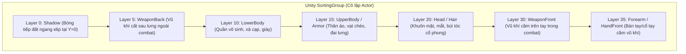
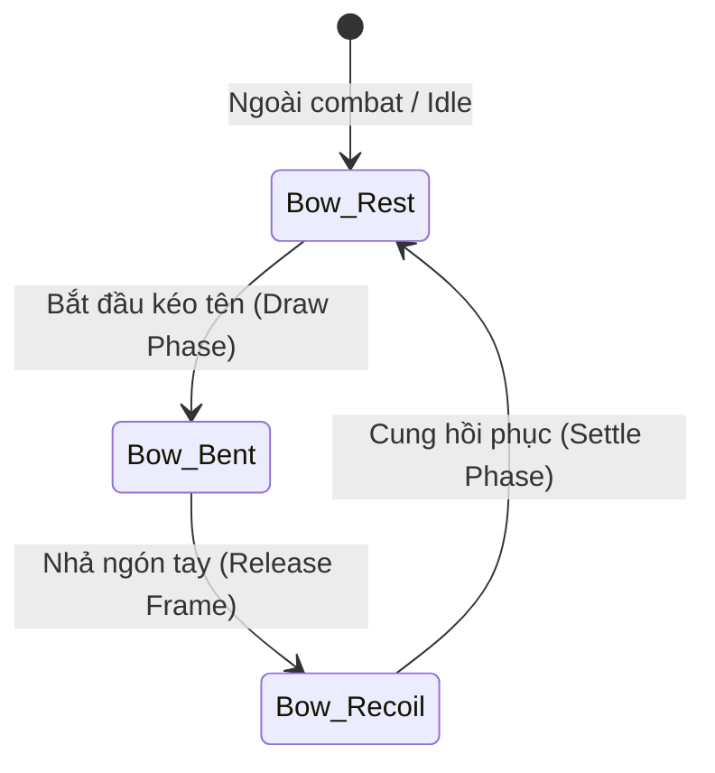
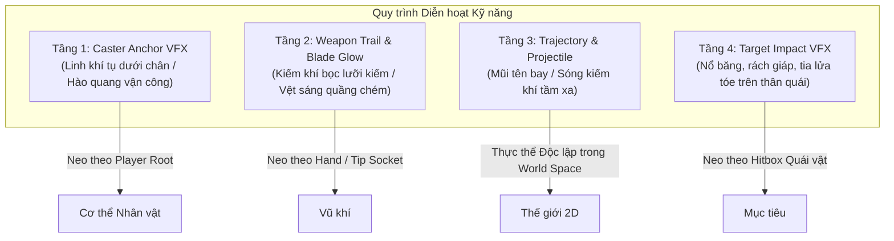

# BÁO CÁO NGHIÊN CỨU CHUYÊN SÂU: KIẾN TRÚC MODULAR CHARACTER, HOÁN ĐỔI VŨ KHÍ & QUY TRÌNH XỬ LÝ DIỄN HOẠT KỸ NĂNG (KIẾM & CUNG) TRONG UNITY 2D
*(Modular Character Architecture, Weapon Swapping & Combat Skill Visual Pipeline for Project Huyền Lộ)*

---

## 1. TỔNG QUAN & BẢN CHẤT CỦA HỆ THỐNG MODULAR 2D

### 1.1. Bằng chứng Thực nghiệm từ Kho Asset `Small` (Ninja School Online)
Khảo sát toàn bộ kho dữ liệu gồm **4.267 file PNG** trích xuất từ client Ninja School Online (NSO) cho thấy cấu trúc sprite của game màn hình ngang kinh điển này **hoàn toàn không sử dụng cơ chế đè layer lên một cơ thể trần hoàn chỉnh (Full Naked BodyBase)**. Thay vào đó, toàn bộ nhân vật được xây dựng dựa trên nguyên lý **"Pose-Indexed Body Parts" (Các mảnh bộ phận được vẽ chuyên biệt theo từng tư thế)**.

Minh chứng rõ ràng nhất nằm ở cấu trúc dải ID liên tục của các bộ trang bị:

```text
[BỘ TRANG PHỤC 1: Tím - Vàng]
Small1951 → Small1970 : 20 mảnh Thân trên & Tay áo (Upper-Body & Arm Poses)
Small1971 → Small1976 :  6 mảnh Thân dưới & Ống chân (Lower-Body & Leg Poses)
Small1977 → Small1978 :  2 góc Đầu & Mũ (Head & Helmet Views)

[BỘ TRANG PHỤC 2: Tím - Xanh]
Small1979 → Small1998 : 20 mảnh Thân trên & Tay áo (Upper-Body & Arm Poses)
Small1999 → Small2004 :  6 mảnh Thân dưới & Ống chân (Lower-Body & Leg Poses)
Small2005 → Small2006 :  2 góc Đầu & Mũ (Head & Helmet Views)
```

Hai khối dữ liệu trên có **chuỗi kích thước ảnh (width × height) từng vị trí giống hệt nhau từng pixel**, chứng minh cả hai bộ trang phục cùng tuân theo một **Quy chuẩn Tư thế Khung (Master Pose Schema)** cố định.

Hơn thế nữa, trong dải `Small1811 → Small1916`, archive chứa hàng loạt chi tiết tay/chân nhỏ **đã được bake sẵn phần da thịt (exposed skin) trực tiếp vào sprite của trang phục** (tay áo kèm bàn tay nắm chuôi, ống quần kèm bắp chân quấn xà cạp). Điều này chứng minh:
1. **Không tồn tại runtime layer người trần đầy đủ**: Không có chuyện dựng một hình nhân khỏa thân chạy animation rồi phủ áo/quần trong suốt lên trên.
2. **Skin và trang phục là một thể thống nhất trong từng Part**: Mỗi mảnh trang phục khi vẽ đã bao gồm luôn phần cơ thể hở ra ở góc nhìn đó.
3. **Phân tách rạch ròi giữa Inventory Icon và Render Fragment**: Dải `Small2020 → Small2034` là các icon trang bị trong túi đồ (`Item Icon`), hoàn toàn tách biệt về hình dáng, kích thước và mục đích sử dụng so với các mảnh sprite nhân vật `1951 → 2006`.

---

### 1.2. Bóc tách Thuật toán Lắp ghép từ Mã nguồn NSO (`nameBK.java`, `nameDO.java`)
Trong mã nguồn NSO client decompiled, toàn bộ cơ chế diễn hoạt và hiển thị nhân vật được điều khiển thông qua một bảng ma trận tư thế tĩnh trong [`nameBK.java`](file:///home/nguyenvanrin/.gemini/antigravity-cli/brain/ebc98840-85c9-423b-a2f4-d7cc0190f869/scratch/client_decompiled/nameBK.java#L70):

```java
// Ma trận tọa độ tư thế 3D trong nameBK.java
public static final int[][][] a = new int[][][]{
    // Pose 0 (Idle 01): Head, Upper, Lower, Weapon
    new int[][]{ {0, -10, 32}, {1, -7, 7}, {1, -11, 15}, {1, -9, 45} },
    // Pose 1 (Idle 02)
    new int[][]{ {0, -10, 33}, {1, -7, 7}, {1, -11, 16}, {1, -9, 46} },
    // Pose 2 (Run 01)
    new int[][]{ {1, -10, 33}, {2, -10, 11}, {2, -9, 16}, {1, -12, 49} },
    // Pose 3 (Run 02)
    new int[][]{ {1, -10, 32}, {3, -11, 9}, {3, -11, 16}, {1, -13, 47} },
    ...
};
```

Cấu trúc của mỗi phần tử trong ma trận:
$$\text{Pose}[S][\text{Slot}] = \{\text{PartIndex},\ dx,\ dy\}$$
- **$S$**: Chỉ số tư thế hiện tại (`this.S`).
- **$\text{Slot}$**: Bộ phận cơ thể:
  - `Slot 0`: Đầu / Tóc (`Head`)
  - `Slot 1`: Thân trên / Áo (`UpperBody / Armor`)
  - `Slot 2`: Thân dưới / Quần (`LowerBody / Pants`)
  - `Slot 3`: Vũ khí (`Weapon`)
- **$\text{PartIndex}$**: Mảnh sprite cần lấy trong mảng asset của món đồ đang trang bị.
- **$dx, dy$**: Độ lệch tọa độ $(X, Y)$ mà Pose quy định để ghép mảnh đó vào trục tâm nhân vật.

Khi vẽ nhân vật tại hàm `nameBK.d(nameGE)` ([`nameBK.java` lines 3076–3120](file:///home/nguyenvanrin/.gemini/antigravity-cli/brain/ebc98840-85c9-423b-a2f4-d7cc0190f869/scratch/client_decompiled/nameBK.java#L3076-L3120)), client tính toán vị trí thực tế trên màn hình:

```java
// Khi quay mặt sang Phải (this.g == 1):
int screenX = charX + nameBK.a[this.S][slot][1] + item.a[partIdx].dx;
int screenY = charY - nameBK.a[this.S][slot][2] + item.a[partIdx].dy;
nameDO.a(graphics, item.a[partIdx].imageID, screenX, screenY, TRANSFORM_NONE, ANCHOR_TOP_LEFT);

// Khi quay mặt sang Trái (this.g == -1):
int screenX = charX - nameBK.a[this.S][slot][1] - item.a[partIdx].dx;
int screenY = charY - nameBK.a[this.S][slot][2] + item.a[partIdx].dy;
nameDO.a(graphics, item.a[partIdx].imageID, screenX, screenY, TRANSFORM_MIRROR_X, ANCHOR_TOP_RIGHT);
```

#### Kết luận Rút ra cho Dự án Huyền Lộ:
1. **Khái niệm `BodyBase` trong tài liệu cần được chuẩn hóa**:
   - `Master Pose Template`: Là **bộ khung quy chuẩn authoring** (tọa độ Pivot chân, Socket tay/lưng, Anchor đầu/hông), không phải là ảnh render nhân vật trần truồng tại runtime.
   - Khi artist vẽ một bộ giáp (Áo I) hay quần (Quần I), họ vẽ các mảnh `Armor_Upper[0..N]`, `Pants_Lower[0..N]` khớp theo từng tư thế của Master Pose Template.
2. **Quy tắc lật hướng (Facing)**:
   - Chỉ author sprite cho hướng Phải (`Facing Right`).
   - Hướng Trái (`Facing Left`) được nội suy bằng cách đảo ngược trục tọa độ $X$ và lật ảnh gương (`Transform Mirror X`).

---

## 2. KIẾN TRÚC GHÉP NỐI & HOÁN ĐỔI TRANG BỊ (EQUIPMENT PIPELINE)

### 2.1. Thứ tự Lớp Hiển thị (Layering & Sorting Order)
Để đảm bảo các bộ phận không bị đè lỗi và vũ khí hiển thị tự nhiên trong cả trạng thái di chuyển lẫn chiến đấu, hệ thống phân chia 7 lớp thứ tự (`SortingOrder`) bên trong một `SortingGroup`:



- **Tại sao `WeaponBack` nằm ở Layer 5?**
  Khi nhân vật đứng Idle 3/4 hoặc chạy, chuôi kiếm hoặc cánh cung vươn lên qua vai, nhưng thân kiếm/thân cung nằm ép phía sau lưng (bị thân áo Layer 15 đè lên).
- **Tại sao `WeaponFront` nằm ở Layer 30?**
  Khi tấn công, vũ khí được rút ra phía trước thân người, đè lên áo và quần.
- **Tại sao cần `HandFront` ở Layer 35?**
  Đặc biệt đối với **Cung**: Bàn tay giữ thân cung phải nằm đè lên trước thân cung, trong khi cánh cung đè lên thân người. Nếu không có Layer 35, cây cung sẽ trông như dính trôi nổi phía trước bàn tay.

---

### 2.2. Quy trình Hoán đổi Trang bị (Armor & Pants Swapping)
Hệ thống trang bị hoạt động theo cơ chế **Data-Driven Part Swapping**:
Mỗi món trang bị là một `EquipmentVisualData` (ScriptableObject) chứa một mảng tham chiếu các Sprite mảnh:

```csharp
[CreateAssetMenu(fileName = "NewEquipmentVisual", menuName = "HuyenLo/Equipment Visual")]
public class EquipmentVisualData : ScriptableObject
{
    public GearSlot slot; // Armor, Pants, Head, Weapon
    public string visualId; // "cloth_robe_01", "iron_armor_02"
    public Sprite[] poseParts; // Mảng các sprite fragment được đánh chỉ số theo PartIndex
}
```

Khi người chơi đổi đồ:
1. Client nhận gói tin thay đồ hoặc cập nhật `Inventory.Equipment`.
2. `ModularCharacterPresenter` lấy `EquipmentVisualData` mới tương ứng với món đồ đó.
3. Khi runtime cập nhật tư thế hiện tại ($S$), renderer tra cứu:
   $$\text{SpriteRenderer.sprite} = \text{CurrentEquipment.poseParts}\left[\text{MasterPose}[S][\text{slot}].\text{partIndex}\right]$$
4. **Không cần re-instantiate GameObject hay tải lại animation clip**. Việc thay đồ diễn ra tức thì trong 1 frame, hoàn toàn không sinh rác bộ nhớ (Zero Garbage Collection).

---

## 3. PHÂN TÍCH CHUYÊN SÂU: PIPELINE VŨ KHÍ — KIẾM VS CUNG

Vũ khí trong Huyền Lộ chia thành 2 họ cơ bản với cách xử lý hình học và diễn hoạt hoàn toàn khác biệt:

```
+----------------------------------------------------------------------------------------------------+
| SO SÁNH ĐẶC TÍNH RENDER & ANIMATION: KIẾM (SWORD) VS CUNG (BOW)                                   |
+----------------------------------------------------------------------------------------------------+
| Tiêu chí             | Kiếm (Melee Weapon)                   | Cung (Ranged Weapon)                |
+----------------------+---------------------------------------+-------------------------------------+
| Biến dạng hình học   | Cứng (Rigid Sprite)                   | Mềm / Biến dạng (Morph/Deformation) |
| Số sprite visual     | 1 Canonical + 3 góc bổ trợ            | 3 Hình thái bắt buộc (Morph states) |
| Anchor xoay          | Grip Socket tại đốc kiếm              | Handle Socket tại tâm tay cầm cung  |
| Trạng thái sau lưng  | Dọc theo sống lưng (Layer 5)          | Đeo chéo vai qua ngực (Layer 5)     |
| Trạng thái trên tay  | Xoay góc tự do theo đường chém       | Cố định góc bắn + Tay kéo dây cung  |
| Cơ chế gây sát thương| Hit-frame tức thời tại Melee Arc      | Spawn đạn bay độc lập (Projectile)  |
+----------------------------------------------------------------------------------------------------+
```

---

### 3.1. Pipeline Vũ khí Kiếm (Sword Pipeline)

#### A. Trạng thái Mang Kiếm (Back Socket $\leftrightarrow$ Hand Socket)
- **Ngoài Combat (Stowed)**:
  - Kiếm nằm ở `Layer_05_WeaponBack`.
  - Transform: Neo vào `Socket_Back` (nằm giữa 2 bả vai, góc nghiêng $35^\circ$ hướng lên trên về phía trước mặt).
  - Renderer `Layer_30_WeaponFront` bị vô hiệu hóa (`enabled = false`).
- **Trong Combat (Drawn)**:
  - Khi bắt đầu đòn đánh (Frame 0 của Attack/Skill), `Layer_05_WeaponBack` ẩn ngay lập tức.
  - `Layer_30_WeaponFront` kích hoạt, kiếm dịch chuyển về `Socket_Hand`.
- **Cosmetic Return Timer**:
  - Khi người chơi ngừng tấn công, vũ khí được giữ trên tay trong một khoảng trễ $1.0\text{s}$ (Cosmetic Hold Duration).
  - Hết thời gian trễ mà không có input mới, nhân vật thực hiện chuyển đổi thu kiếm về lưng trong 1 frame tại điểm dừng của nhịp thở Idle.

#### B. Cơ chế Diễn hoạt Vung Kiếm (Swing Arc & Angles)
Kiếm không cần vẽ 26 hình riêng biệt mà áp dụng mô hình **Hybrid Angular Transform**:
1. **1 Sprite Canonical**: Thanh kiếm chuẩn vẽ dọc ($0^\circ$).
2. **Góc xoay theo Action Phase**:
   - **Anticipation (Chuẩn bị)**: Góc $+45^\circ$ (kiếm đưa ra sau lưng lấy đà).
   - **Active / Slash (Vung chém)**: Góc quét cực nhanh từ $+45^\circ \rightarrow -60^\circ \rightarrow -95^\circ$.
   - **Recovery (Thu thế)**: Góc $-20^\circ$ trước khi trở về thế thủ.
3. **Hiệu ứng Vệt Kiếm (Slash Arc / Trail)**:
   - Không vẽ vệt chém dính liền vào kiếm.
   - Sử dụng một Sprite Arc riêng biệt (hoặc Unity `TrailRenderer`) gắn tại đỉnh mũi kiếm (`Tip Socket`), chỉ xuất hiện trong đúng 2 frame của pha chém mạnh nhất.

---

### 3.2. Pipeline Vũ khí Cung (Bow Pipeline)

Cung là loại vũ khí **không thể chỉ dùng xoay góc** vì cánh cung và dây cung phải uốn cong theo lực kéo của nhân vật.



#### A. 3 Hình thái Sprite của Cung (3 Morph States)
1. **Trạng thái 1 — Cung Thư Thả (`Bow_Rest`)**:
   - Cánh cung thẳng tự nhiên, dây cung căng nhẹ theo đường thẳng nối 2 đầu mút.
   - Dùng khi đeo sau lưng (`WeaponBack`), khi cầm chạy ngoài combat, hoặc khi đứng Idle.
2. **Trạng thái 2 — Cung Căng Dây (`Bow_Bent`)**:
   - Hai cánh cung uốn cong mạnh về phía sau, dây cung tạo thành hình chữ V nhọn hướng về phía má/ngực người bắn.
   - Đi kèm sprite **Mũi tên nạp dây (Nocked Arrow)** nằm gối lên tay cầm và tì vào điểm nhọn của dây cung.
3. **Trạng thái 3 — Cung Bật Nhả (`Bow_Recoil`)**:
   - Dây cung bật mạnh ra phía trước, hai đầu cánh cung rung giật nhẹ.
   - Xuất hiện trong đúng 1 frame ngay sau khi mũi tên rời dây.

#### B. Vòng đời của Mũi Tên (Arrow Lifecycle)
- **Pha Kéo (Draw Phase)**: Mũi tên là một Sprite con nằm trong cây cung, thụt lùi dần theo độ căng của dây cung.
- **Pha Bắn (Release Frame)**:
  1. Mũi tên con trên cây cung bị ẩn đi.
  2. Hệ thống spawn một GameObject độc lập mang component `ArrowProjectile` từ `ProjectilePool` tại tọa độ đầu mũi tên (`ArrowSpawnSocket`).
  3. Mũi tên bay theo phương ngang hoặc quỹ đạo hướng về mục tiêu với vận tốc $v = 18\text{ u/s}$.
  4. Cung chuyển sang sprite `Bow_Recoil` trong $0.08\text{s}$ rồi về `Bow_Rest`.
  5. **Biến mất & Va chạm (Impact / Despawn)**: Khi chạm mục tiêu hoặc hết tầm bay (Max Range = 12 tiles / 384px), mũi tên kích hoạt hiệu ứng va chạm tại tọa độ trúng đích (`VFX_Arrow_Hit` — nổ tia lửa hoặc cắm vào mục tiêu).

#### C. Đối chiếu Mã nguồn Thực tế từ NSO Client/Server (Hệ Thống Đạn Bay & Bảng Góc 16 Hướng)
Khảo sát trực tiếp mã nguồn NSO server (`com.nsoz.server.Server.java`), CSDL `nsoz.sql` và client decompiled (`nameCS.java`):

1. **Cấu hình CSDL (`nj_arrow` trong `nsoz.sql`)**:
   Mỗi loại đạn/mũi tên trong NSO được cấu hình bằng đúng **3 Sprite ID**:
   ```sql
   INSERT INTO `nj_arrow` (`id`, `imgId`) VALUES
   (1, "[264,265,266]"),    -- Mũi tên cơ bản của phái Cung
   (2, "[444,445,446]"),    -- Đạn phi tiêu cấp 20
   (3, "[447,448,449]"),    -- Đạn phi tiêu cấp 30
   (13, "[2257,2258,2259]"); -- Đạn mũi tên cấp cao
   ```
   Kiểm tra trực tiếp các file ảnh trong `research/SRC NSOACE FIX/Data/Img/Small/1/`:
   - `Small264.png`: Kích thước $20 \times 4$ px (Mũi tên bay ngang hoàn toàn, góc $0^\circ$).
   - `Small265.png`: Kích thước $18 \times 11$ px (Mũi tên bay xiên chéo, góc $45^\circ$).
   - `Small266.png`: Kích thước $12 \times 18$ px (Mũi tên bay dốc/thẳng đứng, góc $90^\circ$).
   Tương tự với bộ đạn phi tiêu `Small444` ($20 \times 4$), `Small445` ($18 \times 11$), `Small446` ($12 \times 18$).

2. **Thuật toán Chọn Sprite & Góc Quay trong Client NSO (`nameCS.java`)**:
   Client J2ME không dùng hàm xoay sprite float tự do (vì giới hạn CPU di động thời đó), mà dùng **Lookup Table 16 sector góc** để chọn 1 trong 3 sprite và kết hợp cờ lật transform:
   ```java
   // Trích xuất trực tiếp từ nameCS.java (Class quản lý Arrow Projectile của NSO)
   public static void _cinitclone() {
       // Mảng ánh xạ 16 sector góc sang 3 index sprite (0: ngang, 1: chéo, 2: đứng)
       a = new byte[]{0, 1, 2, 1, 0, 1, 2, 1, 0, 1, 2, 1, 0, 1, 2, 1, 0, 1, 2, 1, 0, 1, 2, 1, 0};
       // Bảng phân ngưỡng góc arctan (0 -> 360 độ)
       a = new int[]{0, 15, 37, 52, 75, 105, 127, 142, 165, 195, 217, 232, 255, 285, 307, 322, 345, 370};
       // Bảng mã transform của Graphics J2ME (0: None, 2: Mirror X, 3: Mirror Y, 5: Rotate 90, 6: Rotate 180, 7: Rotate 270)
       b = new int[]{0, 0, 0, 7, 6, 6, 6, 2, 2, 3, 3, 4, 5, 5, 5, 1};
   }

   public final void a(nameGE g) {
       int dx = this.targetX - this.posX;
       int dy = this.targetY - this.posY;
       int angle = nameDN.a(dx, -dy); // Tính góc bay arctan2
       // Duyệt tìm sector n trong bảng ngưỡng góc a
       // Gọi hàm vẽ: nameDO.a(g, this.arrowData.sprites[a[n]], this.posX, this.posY, b[n], 3);
   }
   ```

3. **Bài học Kỹ thuật cho Unity**:
   - Unity hỗ trợ phép quay liên tục mượt mà thông qua `transform.rotation = Quaternion.Euler(0, 0, angle)`.
   - Tuy nhiên, việc cung cấp 3 sprite góc ($0^\circ, 45^\circ, 90^\circ$) theo chuẩn pixel art gốc như NSO là giải pháp tối ưu nhất để tránh hiện tượng vỡ nét pixel chéo (aliasing / shimmer artifacts) khi bay ở các hướng đặc thù.

---

## 4. QUY TRÌNH XỬ LÝ DIỄN HOẠT KỸ NĂNG & HIỆU ỨNG ĐA TẦNG (SKILL VISUAL PIPELINE)

### 4.1. Khảo sát Cấu trúc Timeline Kỹ năng (Client nameES[] & Server SkillPaint.java / nsoz.sql)
Trong NSO, mỗi kỹ năng khi thi triển được định nghĩa bởi một chuỗi mảng các frame diễn hoạt. Khảo sát toàn diện cả hai đầu Client và Server:

#### A. Cấu trúc Server (SkillInfoPaint.java & Bảng nj_skill)
Mỗi kỹ năng được lưu thành một mảng JSON các keyframe chứa tới 13 tham số điều khiển đồng bộ:
```sql
-- Trích từ nj_skill trong nsoz.sql:
(1, 1, 50, 1, "[{"status":13, "effS0Id":0, "e0dx":0, "e0dy":0, "effS1Id":0, "e1dx":0, "e1dy":0, "effS2Id":0, "e2dx":0, "e2dy":0, "arrowId":0, "adx":0, "ady":0}, ...]")
(13, 23, 3, 1, "[{"status":18, "effS0Id":1, "e0dx":0, "e0dy":0, "effS1Id":2, "e1dx":49, "e1dy":-7, "effS2Id":42, "e2dx":29, "e2dy":-14, "arrowId":0, "adx":0, "ady":0}, ...]")
```
Mỗi frame quy định chính xác:
1. `status`: Pose ID của nhân vật (ví dụ 13: Thế vung vũ khí cơ bản, 18: Thế phóng chiêu uy lực).
2. `effS0Id`, `e0dx`, `e0dy`: Hiệu ứng tầng 0 (Aura/Ground cast circle dưới chân).
3. `effS1Id`, `e1dx`, `e1dy`: Hiệu ứng tầng 1 (Ánh sáng lưỡi kiếm / Vệt chém / Năng lượng trên tay).
4. `effS2Id`, `e2dx`, `e2dy`: Hiệu ứng tầng 2 (Tia lửa / Bùng nổ va chạm tại mục tiêu).
5. `arrowId`, `adx`, `ady`: ID đạn bay tương ứng (`nj_arrow`) và tọa độ spawn ban đầu so với nhân vật.

Server chia rõ 2 mảng diễn hoạt (`SkillPaint.java`):
- `skillStand[]`: Chuỗi frame thực hiện khi nhân vật đang đứng trên mặt đất.
- `skillfly[]`: Chuỗi frame thực hiện khi nhân vật đang nhảy trên không trung.

#### B. Phía Client (nameBK.java lines 2087–2112)

Trong NSO, mỗi kỹ năng khi thi triển được định nghĩa bởi một chuỗi mảng các đối tượng `nameES` ([`nameBK.java` lines 2087–2112](file:///home/nguyenvanrin/.gemini/antigravity-cli/brain/ebc98840-85c9-423b-a2f4-d7cc0190f869/scratch/client_decompiled/nameBK.java#L2087-L2112)):

```java
nameES[] skillFrames = player.getSkillAnimation();
// Tại mỗi frame của skill:
int poseIndex   = skillFrames[currentFrame].a; // Tư thế nhân vật
int vfx1_Id     = skillFrames[currentFrame].b; // Hiệu ứng tầng 1
int vfx1_dx     = skillFrames[currentFrame].c; // Tọa độ X của VFX 1
int vfx1_dy     = skillFrames[currentFrame].d; // Tọa độ Y của VFX 1
int vfx2_Id     = skillFrames[currentFrame].e; // Hiệu ứng tầng 2
...
```

Điều này chứng minh triết lý thiết kế cốt lõi:
> **Hiệu ứng kỹ năng (VFX) không bao giờ được vẽ chết vào sprite nhân vật hay sprite vũ khí.**
> Kỹ năng là sự kết hợp đồng bộ theo thời gian giữa: **Tư thế cơ thể (Pose)** + **Trạng thái vũ khí (Weapon State)** + **Hiệu ứng rời (Modular VFX Overlays)**.

---

### 4.2. Kiến trúc Hiệu ứng 4 Tầng trong Huyền Lộ (4-Tier Skill VFX Architecture)



1. **Tầng 1 — Caster Anchor VFX (Hiệu ứng Niệm/Tụ lực)**:
   - Neo trực tiếp theo tâm hoặc chân nhân vật (`(32, 0)`).
   - Ví dụ: Vòng sáng Mạch Ấn bừng nở dưới đất khi bắt đầu tụ chiêu, tóc bay nhẹ.
2. **Tầng 2 — Weapon Trail / Blade Glow (Hiệu ứng Thân vũ khí)**:
   - Neo theo `Hand Socket` và `Tip Socket`.
   - Với Kiếm: Lưỡi kiếm bọc một lớp ánh sáng xanh (Hàn Băng) hoặc đỏ (Liệt Hỏa) trong lúc vung đòn.
   - Với Cung: Đầu mũi tên phát sáng tụ linh khí trong lúc dây cung kéo căng.
3. **Tầng 3 — Trajectory & Projectile (Hiệu ứng Đường đạn)**:
   - Hoàn toàn độc lập với nhân vật sau khi phát ra.
   - Di chuyển theo vận tốc vật lý, mang collider/trigger kiểm tra va chạm với bãi quái.
4. **Tầng 4 — Target Impact VFX (Hiệu ứng Trúng đòn)**:
   - Spawn tại điểm trúng đòn trên thân quái vật (Target Center).
   - Di chuyển theo quái vật nếu quái vật bị đẩy lùi hoặc ngã chết.

---

### 4.3. Kịch bản Diễn hoạt Chi tiết: Kỹ năng Kiếm S1 vs Kỹ năng Cung S1

#### Kỹ năng Kiếm S1 (Tật Phong Kiếm — 4 Logical Frames / 12 FPS / Tổng $0.33\text{s}$)
- **Frame 0 (Chuẩn bị — $0.08\text{s}$)**:
  - Pose: Hạ thấp trọng tâm, chân trước khuỵu, kiếm giương chéo ngang hông ($+30^\circ$).
  - Weapon: `Layer_30_WeaponFront`, Mộc Kiếm rút ra tay.
  - VFX Tầng 1: Một vòng gió nhỏ tụ dưới gót chân sau.
- **Frame 1 (Tụ lực / Lao đòn — $0.08\text{s}$)**:
  - Pose: Thân người nhoài tới trước theo phương ngang, kiếm đưa hẳn ra sau lưng ($+60^\circ$).
  - VFX Tầng 2: Vệt kiếm khí bắt đầu sáng rực ở đầu mũi kiếm.
- **Frame 2 (Phát lực / Vung chém — $0.08\text{s}$ — HIT FRAME)**:
  - Pose: Kiếm quét thẳng một góc cung rộng $155^\circ$ (từ $+60^\circ \rightarrow -95^\circ$).
  - VFX Tầng 2: Quầng sáng hình lưỡi liềm (Slash Arc) bùng phát quét trọn phạm vi $1.8\text{ u}$ phía trước.
  - Gameplay Hook: Server tính toán sát thương; client spawn **Target Impact VFX** trên toàn bộ quái trong vùng chém.
- **Frame 3 (Hồi thế / Thu kiếm — $0.09\text{s}$)**:
  - Pose: Trả thế đứng vững, kiếm dựng chéo góc phòng thủ $-20^\circ$.
  - VFX: Vệt sáng tan biến dần (Fade out $0.1\text{s}$).

#### Kỹ năng Cung S1 (Xuyên Tâm Tiễn — 4 Logical Frames / 12 FPS / Tổng $0.42\text{s}$)
- **Frame 0 (Rút tên nạp dây — $0.10\text{s}$)**:
  - Pose: Chân đứng thế đinh, tay nâng thân cung lên ngang ngực.
  - Weapon: Cung ở hình thái `Bow_Rest`, mũi tên nạp vào rãnh.
- **Frame 1 (Kéo căng tụ khí — $0.14\text{s}$)**:
  - Pose: Tay kéo giật mạnh dây cung về sát gò má, ngực nở rộng, chân trụ ghì chặt đất.
  - Weapon: Cung chuyển sang hình thái `Bow_Bent`, mũi tên thụt lùi $6\text{px}$ theo dây cung.
  - VFX Tầng 2: Luồng xoáy khí tụ xoay tròn quanh mũi tên.
- **Frame 2 (Phóng tiễn — $0.08\text{s}$ — SPAWN FRAME)**:
  - Pose: Tay sau buông lỏng dây, thân người hơi ngả theo lực đẩy.
  - Weapon: Cung giật sang hình thái `Bow_Recoil`, mũi tên trên dây biến mất.
  - VFX Tầng 3: Spawn thực thể `ArrowProjectile` lao vút đi với tốc độ cao, kéo theo vệt sáng gió (Wind Ribbon Trail).
- **Frame 3 (Hồi thế — $0.10\text{s}$)**:
  - Pose: Hạ tay, xoay cung về thế cầm dọc.
  - Weapon: Cung trở về hình thái `Bow_Rest`.

---

## 5. THIẾT KẾ KIẾN TRÚC CHUYỂN ĐỔI SANG UNITY ENGINE

### 5.1. Mô hình Cây GameObject & Phân cấp Thành phần (Hierarchy)

```text
PlayerActor (Root: Transform, Rigidbody2D, BoxCollider2D, SliceController)
│
├── VisualRoot (Chứa toàn bộ hiển thị - Lật hướng bằng LocalScale.x = ±1)
│   │
│   ├── SortingGroup (Sorting Layer: "Characters", Order: 0)
│   │
│   ├── Layer_00_Shadow        (SpriteRenderer, OrderInLayer: 0)
│   ├── Layer_05_WeaponBack    (SpriteRenderer, OrderInLayer: 5)
│   ├── Layer_10_LowerBody     (SpriteRenderer, OrderInLayer: 10)
│   ├── Layer_15_UpperBody     (SpriteRenderer, OrderInLayer: 15)
│   ├── Layer_20_Head          (SpriteRenderer, OrderInLayer: 20)
│   ├── Layer_30_WeaponFront   (SpriteRenderer, OrderInLayer: 30)
│   └── Layer_35_HandFront     (SpriteRenderer, OrderInLayer: 35)
│
├── Sockets (Các điểm neo tọa độ động)
│   ├── Socket_Hand            (Transform: Vị trí tay cầm kiếm/cung)
│   ├── Socket_Back            (Transform: Vị trí bao kiếm/cánh cung sau lưng)
│   ├── Socket_ArrowTip        (Transform: Vị trí đầu mũi tên để spawn Projectile)
│   └── Socket_CastAura        (Transform: Vị trí dưới chân Y=0 để spawn vòng sáng)
│
└── Presenter                  (Script: ModularCharacterPresenter.cs)
```

> [!TIP]
> **Giải pháp Lật hướng Tuyệt đối (FlipX Problem):**
> Tuyệt đối không dùng `SpriteRenderer.flipX` trên từng layer con vì thuộc tính này chỉ lật texture mà không lật tọa độ Transform của các Socket con.
> Giải pháp chuẩn xác là lật toàn bộ `VisualRoot.localScale = new Vector3(facing, 1, 1)` (với `facing = 1` hoặc `-1`). Toàn bộ sprite và socket con sẽ tự động đối xứng hoàn hảo qua trục gốc.

---

### 5.2. Cấu trúc Mã Nguồn C# Hoàn chỉnh

#### 1. Bảng Dữ liệu Tư thế Chuẩn (`MasterPoseDatabase.cs`)
```csharp
using System;
using UnityEngine;

namespace HuyenLo.Runtime.Art
{
    public enum PoseSlot { Head = 0, Upper = 1, Lower = 2, Weapon = 3 }

    [Serializable]
    public struct PosePartOffset
    {
        public int partIndex;  // Mảnh sprite trong set đồ
        public Vector2 offset; // Tọa độ tương đối theo pixel hoặc units
        public float angle;    // Góc xoay bổ trợ (nếu có)
    }

    [Serializable]
    public class MasterPoseFrame
    {
        public string poseName; // "Idle_01", "Attack_02", etc.
        public PosePartOffset head;
        public PosePartOffset upper;
        public PosePartOffset lower;
        public PosePartOffset weapon;
    }

    [CreateAssetMenu(fileName = "MasterPoseDatabase", menuName = "HuyenLo/Art/Master Pose Database")]
    public class MasterPoseDatabase : ScriptableObject
    {
        public MasterPoseFrame[] frames = new MasterPoseFrame[26];
    }
}
```

#### 2. Dữ liệu Trang bị Theo Mảnh (`EquipmentVisualData.cs`)
```csharp
using UnityEngine;

namespace HuyenLo.Runtime.Art
{
    public enum WeaponCategory { None, Sword, Bow }

    [CreateAssetMenu(fileName = "EquipmentVisual", menuName = "HuyenLo/Art/Equipment Visual")]
    public class EquipmentVisualData : ScriptableObject
    {
        public string visualId;
        public GearSlot slot;
        public WeaponCategory weaponCategory;

        [Header("Sprites mapped by PartIndex")]
        public Sprite[] parts; // Danh sách các sprite mảnh vẽ theo Master Pose

        [Header("Chỉ dành cho Cung (Morph States)")]
        public Sprite bowRest;
        public Sprite bowBent;
        public Sprite bowRecoil;
    }
}
```

#### 3. Bộ Điều khiển Lắp ghép Runtime (`ModularCharacterPresenter.cs`)
```csharp
using System.Collections;
using UnityEngine;
using UnityEngine.Rendering;

namespace HuyenLo.Runtime.Art
{
    [RequireComponent(typeof(SortingGroup))]
    public class ModularCharacterPresenter : MonoBehaviour
    {
        [Header("Configuration")]
        [SerializeField] private MasterPoseDatabase poseDatabase;

        [Header("Layer Renderers")]
        [SerializeField] private SpriteRenderer shadowRenderer;
        [SerializeField] private SpriteRenderer weaponBackRenderer;
        [SerializeField] private SpriteRenderer lowerBodyRenderer;
        [SerializeField] private SpriteRenderer upperBodyRenderer;
        [SerializeField] private SpriteRenderer headRenderer;
        [SerializeField] private SpriteRenderer weaponFrontRenderer;
        [SerializeField] private SpriteRenderer handFrontRenderer;

        [Header("Sockets")]
        [SerializeField] private Transform socketHand;
        [SerializeField] private Transform socketBack;
        [SerializeField] private Transform socketArrowTip;

        [Header("Current Equipment")]
        private EquipmentVisualData currentHead;
        private EquipmentVisualData currentUpper;
        private EquipmentVisualData currentLower;
        private EquipmentVisualData currentWeapon;

        private bool inCombat;
        private Coroutine combatHoldCoroutine;

        public void SetFacing(int facing)
        {
            // facing: 1 (Right), -1 (Left)
            transform.localScale = new Vector3(facing, 1, 1);
        }

        public void EquipItem(EquipmentVisualData data)
        {
            if (data == null) return;
            switch (data.slot)
            {
                case GearSlot.Helmet: currentHead = data; break;
                case GearSlot.Armor:  currentUpper = data; break;
                case GearSlot.Pants:  currentLower = data; break;
                case GearSlot.Weapon: currentWeapon = data; break;
            }
        }

        public void ApplyPose(int poseIndex)
        {
            if (poseDatabase == null || poseIndex < 0 || poseIndex >= poseDatabase.frames.Length) return;

            var frame = poseDatabase.frames[poseIndex];

            // 1. Áp dụng Head
            if (currentHead != null && frame.head.partIndex < currentHead.parts.Length)
            {
                headRenderer.sprite = currentHead.parts[frame.head.partIndex];
                headRenderer.transform.localPosition = frame.head.offset;
            }

            // 2. Áp dụng Upper / Armor
            if (currentUpper != null && frame.upper.partIndex < currentUpper.parts.Length)
            {
                upperBodyRenderer.sprite = currentUpper.parts[frame.upper.partIndex];
                upperBodyRenderer.transform.localPosition = frame.upper.offset;
            }

            // 3. Áp dụng Lower / Pants
            if (currentLower != null && frame.lower.partIndex < currentLower.parts.Length)
            {
                lowerBodyRenderer.sprite = currentLower.parts[frame.lower.partIndex];
                lowerBodyRenderer.transform.localPosition = frame.lower.offset;
            }

            // 4. Áp dụng Weapon theo trạng thái Combat
            ApplyWeaponPose(frame);
        }

        private void ApplyWeaponPose(MasterPoseFrame frame)
        {
            if (currentWeapon == null)
            {
                weaponBackRenderer.enabled = false;
                weaponFrontRenderer.enabled = false;
                return;
            }

            if (!inCombat)
            {
                // Vũ khí cất sau lưng (Back Socket)
                weaponBackRenderer.enabled = true;
                weaponFrontRenderer.enabled = false;
                weaponBackRenderer.sprite = currentWeapon.parts.Length > 0 ? currentWeapon.parts[0] : null;
                weaponBackRenderer.transform.position = socketBack.position;
                weaponBackRenderer.transform.rotation = socketBack.rotation;
            }
            else
            {
                // Vũ khí cầm trên tay (Hand Socket)
                weaponBackRenderer.enabled = false;
                weaponFrontRenderer.enabled = true;

                if (currentWeapon.weaponCategory == WeaponCategory.Sword)
                {
                    int wIdx = Mathf.Clamp(frame.weapon.partIndex, 0, currentWeapon.parts.Length - 1);
                    weaponFrontRenderer.sprite = currentWeapon.parts[wIdx];
                    weaponFrontRenderer.transform.position = socketHand.position;
                    weaponFrontRenderer.transform.localRotation = Quaternion.Euler(0, 0, frame.weapon.angle);
                }
                else if (currentWeapon.weaponCategory == WeaponCategory.Bow)
                {
                    // Lựa chọn morph state dựa trên tư thế
                    weaponFrontRenderer.sprite = frame.weapon.partIndex switch
                    {
                        1 => currentWeapon.bowBent,
                        2 => currentWeapon.bowRecoil,
                        _ => currentWeapon.bowRest
                    };
                    weaponFrontRenderer.transform.position = socketHand.position;
                    weaponFrontRenderer.transform.localRotation = Quaternion.Euler(0, 0, frame.weapon.angle);
                }
            }
        }

        public void TriggerCombatState()
        {
            inCombat = true;
            if (combatHoldCoroutine != null) StopCoroutine(combatHoldCoroutine);
            combatHoldCoroutine = StartCoroutine(CombatHoldTimer(1.2f));
        }

        private IEnumerator CombatHoldTimer(float duration)
        {
            yield return new WaitForSeconds(duration);
            inCombat = false;
        }
    }
}
```

---

## 6. MA TRẬN MAPPING 26 LOGICAL FRAMES & ASSET BUDGET THỰC TẾ

Dựa trên nghiên cứu NSO, chúng ta có thể tối ưu hóa ma trận 26 logical frames của Huyền Lộ để giảm tối đa khối lượng vẽ nhưng vẫn đảm bảo diễn hoạt mượt mà:

```
+---------------------------------------------------------------------------------------------------------+
| MA TRẬN PHÂN BỔ 26 LOGICAL FRAMES VÀ TỶ LỆ TÁI SỬ DỤNG SPRITE (SPRITE REUSE MATRIX)                    |
+---------------------------------------------------------------------------------------------------------+
| State          | Logical Frames | Sprite Head | Sprite Upper | Sprite Lower | Weapon Frame (Kiếm / Cung)|
+----------------+----------------+-------------+--------------+--------------+---------------------------+
| Idle           | 4 (Nhịp thở)   | Head 0      | Upper 0, 1   | Lower 0      | Back Socket / Rest        |
| Run            | 6 (Cadence)    | Head 1      | Upper 2, 3   | Lower 1 → 6  | Back Socket / Rest        |
| Jump           | 2 (Takeoff)    | Head 1      | Upper 4      | Lower 7      | Back Socket / Rest        |
| Fall           | 2 (Apex/Fall)  | Head 0      | Upper 5      | Lower 8      | Back Socket / Rest        |
| Attack (Kiếm)  | 3 (Swing)      | Head 1      | Upper 6, 7, 8| Lower 0      | Hand: +45° -> -60° -> -95°|
| Attack (Cung)  | 3 (Draw/Shoot) | Head 1      | Upper 9,10,11| Lower 0      | Hand: Rest -> Bent -> Rec |
| Skill (S1)     | 4 (Cast/Burst) | Head 2      | Upper12..14  | Lower 0      | Hand + VFX Trail / Arrow  |
| Hit            | 2 (Recoil)     | Head 2      | Upper 15     | Lower 0      | Flash Overlay / Hand      |
| Death          | 3 (Pop/Fall)   | Head 2      | Upper 16     | Lower 9      | Dropped to ground         |
+----------------+----------------+-------------+--------------+--------------+---------------------------+
| TỔNG SỐ RASTER | 26 Logic       | 3 Mảnh      | 14–17 Mảnh   | 7–9 Mảnh     | 4 Kiếm / 3 Cung           |
+---------------------------------------------------------------------------------------------------------+
```

### Đánh giá Chi phí Sản xuất (Production Accounting):
- **Nếu hiểu sai theo kiểu cũ (Vẽ cả người cho mọi biến thể)**:
  $26\text{ frames} \times 7\text{ bộ đồ} \times 2\text{ phái} = \mathbf{364\text{ full character sprites}}$. Khối lượng khổng lồ không thể kham nổi cho indie studio.
- **Nếu áp dụng chuẩn Modular Pose-Indexed NSO**:
  - Mỗi bộ Áo chỉ cần vẽ **14–17 mảnh nhỏ** ($24\times 30\text{px}$).
  - Mỗi bộ Quần chỉ cần vẽ **7–9 mảnh nhỏ** ($20\times 24\text{px}$).
  - Mỗi kiểu Tóc chỉ cần vẽ **3 mảnh nhỏ** ($16\times 16\text{px}$).
  - Mỗi cây Kiếm chỉ cần **1 sprite canonical** ($10\times 32\text{px}$) + code xoay góc.
  - Mỗi cây Cung chỉ cần **3 sprite hình thái** ($16\times 32\text{px}$).
- **Tổng số sprite raster thực tế giảm hơn 65%**, trong khi hệ thống cho phép người chơi tùy ý mix-and-match giữa hàng trăm ngàn tổ hợp trang bị khác nhau mà không bao giờ bị vỡ hình.

---

## 7. BẢN ĐỒ LIÊN KẾT VỚI HỆ THỐNG TÀI LIỆU DỰ ÁN (DOCS INTEGRATION) & CÁC ĐỀ XUẤT KHUYẾN NGHỊ (RECOMMENDATIONS - RCM)

Đối chiếu toàn diện với các tài liệu thiết kế gốc trong thư mục `/docs/`:
- `docs/03-art/art-and-visual-production.md` (Kiến trúc hình ảnh Player, 26 Logical Frames, 7 Weapon Visuals, Sorting Order, Skill VFX Framework).
- `docs/01-design/combat-and-character.md` (Quy tắc Combat Kiếm vs Cung, Snapshot Action, Propagation, Target Resolve).
- `docs/02-technical/gameplay-runtime.md` (Gameplay State Machine, Sockets, Presentation Layer).

Dưới đây là 5 nhóm khuyến nghị chiến lược (RCM) đề xuất bổ sung vào quy trình sản xuất và triển khai:

```
                                    [ DỰ ÁN HUYỀN LỘ (DOCS) ]
                                                │
         ┌──────────────────────────────────────┼──────────────────────────────────────┐
         ▼                                      ▼                                      ▼
[ docs/03-art/... ]                    [ docs/01-design/... ]                 [ docs/02-technical/... ]
• 26 Logical Frames                    • Snapshot Action Execution            • Presentation Layer
• Modular Parts (Body/Hair/Armor/Leg)  • Kiếm S1/S2/S3 (Melee/Warm/AoE)       • Unity SortingGroup
• Back/Hand Weapon Socket              • Cung S1/S2/S3 (Ranged/Cold/Arrows)   • SpriteRenderer + Pooling
         │                                      │                                      │
         └──────────────────────────────────────┼──────────────────────────────────────┘
                                                │ (Đối chiếu & Kiểm chứng)
                                                ▼
                         [ NGHIÊN CỨU THỰC TẾ NSO (RESEARCH) ]
                         • Part.java & nj_part: Body (18 img), Leg (10 img), Head (8 img), Weapon (2 img)
                         • nameBK.java: Ma trận Pose[S][Slot] = {partIndex, dx, dy} + Mirror X
                         • nj_arrow & nameCS.java: 3 Sprite góc bay + 16-sector Lookup Table
                         • SkillInfoPaint.java: 13 params (Pose ID, 3-tier VFX dx/dy, Arrow spawn)
```

---

### 🎯 RCM-01: Định Nghĩa Lại Thuật Ngữ & Tư Duy `BodyBase` trong Quy Trình Sản Xuất Art
* **Thực trạng trong Docs hiện tại:**
  - Mục `1. Kiến trúc hình ảnh player` (`docs/03-art/art-and-visual-production.md`) mô tả slot đầu tiên là `BodyBase: Da, tay, cổ, phần cơ thể nhìn thấy; pose tay cầm/ra đòn`.
  - **Rủi ro sản xuất:** Khi Artist hoặc AI đọc spec này, họ sẽ vẽ một nhân vật trần truồng hoàn chỉnh (Full Naked Body) cho cả 26 frames, rồi vẽ áo/quần trong suốt đè lên. Điều này gây lỗi viền lót, lệch khớp chuyển động và tăng gấp đôi khối lượng vẽ vô ích.
* **Bằng chứng thực nghiệm NSO:**
  - NSO hoàn toàn không có runtime naked body. Các mảnh `UpperBody/Armor` (`Small1951..1970`) đã bake trực tiếp phần da lộ ở cổ và tay theo đúng tư thế tương ứng.
* **Đề xuất khuyến nghị (RCM):**
  1. Trong tài liệu hướng dẫn vẽ, chuyển đổi cách gọi `BodyBase` thành **`Master Pose Template`** (chỉ là khung xương tham chiếu wireframe/pivot guide, không xuất ra sprite game).
  2. Mỗi mảnh `Armor` sẽ sở hữu phần da tương ứng của tư thế đó. `BodyBase` trong engine Unity chỉ đóng vai trò fallback skin tint khi nhân vật cởi hết trang bị (*Default Mộc outfit*).

---

### 🎯 RCM-02: Quy Chuẩn Hóa Dải Sprite Vũ Khí: Kiếm (Rigid Transform) vs Cung (3 Morph States)
* **Thực trạng trong Docs hiện tại:**
  - Mục `2. Tiến trình hình ảnh vũ khí` (`docs/03-art/art-and-visual-production.md`) ước tính kịch bản Hybrid: Kiếm cần 1–4 hình/visual; Cung cần 3 hình/visual. Tổng ngân sách khoảng 13–25 ô hình cho 7 weapon visuals catalog.
* **Bằng chứng thực nghiệm NSO:**
  - Trong NSO (`nj_part` Type 3), mỗi vũ khí Kiếm chỉ lưu **2 PartImage** (Back Socket và Hand Socket), xoay góc hoàn toàn bằng ma trận transform. Cung cần uốn cong cánh và kéo căng dây nên bắt buộc phải thay đổi sprite hình thái.
* **Đề xuất khuyến nghị (RCM):**
  1. **Đối với Kiếm**: Chốt cứng phương án **1 Canonical Sprite ($0^\circ$) duy nhất cho mỗi cây kiếm**. Diễn hoạt chém dùng Unity Transform xoay quanh `Grip Socket` theo Action Phase (`Anticipation: +45°`, `Active: -60°`, `Recovery: -20°`). Vệt chém `Slash Arc` tách 100% thành VFX Sprite riêng.
  2. **Đối với Cung**: Khóa cứng mô hình **3 Morph Sprites**:
     - `Bow_Rest`: Cánh thẳng, dây chùng (dùng cho Idle, Run, Stowed sau lưng).
     - `Bow_Bent`: Cánh cong gập, dây căng nhọn kèm mũi tên nạp sẵn (nocked).
     - `Bow_Recoil`: Cánh giật, dây rung (xuất hiện đúng 1 frame $\approx 0.08\text{s}$ lúc nhả tên).
  3. **Ngân sách thực tế tối ưu**: 4 Kiếm $\times$ 1 hình + 3 Cung $\times$ 3 hình = **13 Sprite vũ khí duy nhất** cho toàn bộ 7 visual catalog. Tiết kiệm 48% chi phí sản xuất art so với cận trên 25 hình.

---

### 🎯 RCM-03: Kỹ Thuật Hóa Hệ Thống Mũi Tên & Đạn Bay (Arrow Projectile Pipeline)
* **Thực trạng trong Docs hiện tại:**
  - Docs quy định mũi tên có 1 silhouette chung, bay tới mục tiêu resolve sát thương tại mốc $+0.12\text{s}$ (S1) hoặc $+0.18\text{s}$ (Hàn Tiễn S3). VFX không tự quyết định damage authority.
* **Bằng chứng thực nghiệm NSO:**
  - CSDL `nj_arrow` lưu đúng 3 Sprite cho mỗi loại đạn: ngang $0^\circ$ (`Small264` $20 \times 4$ px), chéo $45^\circ$ (`Small265` $18 \times 11$ px), thẳng đứng $90^\circ$ (`Small266` $12 \times 18$ px).
  - Client NSO (`nameCS.java`) ánh xạ góc arctan2 sang 16 sector góc để chọn 1 trong 3 sprite trên kèm cờ lật transform.
* **Đề xuất khuyến nghị (RCM):**
  1. Unity 2D có thể xoay mượt `transform.rotation = Quaternion.Euler(0, 0, angle)`.
  2. Tuy nhiên, để tránh hiện tượng vỡ nét pixel (anti-aliasing shimmer) khi mũi tên bay ở các góc chéo chính, nên áp dụng kỹ thuật NSO: chuẩn bị 2 sprite (1 ngang chuẩn, 1 chéo chuẩn $45^\circ$) và chuyển đổi sprite dựa trên góc bay trước khi áp góc quay tinh chỉnh.
  3. Quản lý toàn bộ mũi tên bay bằng **Unity Object Pooling (`ProjectilePool`)**, không `Instantiate()`/`Destroy()` theo từng phát bắn để loại bỏ hoàn toàn GC Alloc rác bộ nhớ.

---

### 🎯 RCM-04: Phân Tầng Kỹ Năng & VFX 4 Lớp (Đồng Bộ với `SkillInfoPaint` và Timeline Gameplay)
* **Thực trạng trong Docs hiện tại:**
  - Mục `4. Framework Lv 1 → Lv 20` (`docs/03-art/art-and-visual-production.md`) phân tách: Main skill VFX, Projectile, Per-target impact, Target reaction, Damage text, Status.
  - S2 được ưu tiên là đòn farm chính, không kéo action lock để nhét VFX dài.
* **Bằng chứng thực nghiệm NSO:**
  - `SkillInfoPaint.java` đồng bộ mỗi frame với 13 tham số: `status` (Tư thế cơ thể), `effS0Id` (Aura chân), `effS1Id` (Ánh sáng vũ khí), `effS2Id` (Va chạm nổ mục tiêu), và `arrowId` (Đạn bay).
  - Phân tách rõ mảng `skillStand[]` (dưới đất) và `skillfly[]` (trên không).
* **Đề xuất khuyến nghị (RCM):**
  1. Trong Unity, xây dựng `SkillVisualTimelineSO` bám sát chuẩn NSO:
     - **Layer 0 (Sorting Order 2)**: Vòng tròn niệm chú/linh khí mặt đất.
     - **Layer 1 (Sorting Order 32)**: Ánh kiếm rực sáng, vệt chém `Slash Arc`.
     - **Layer 2 (Sorting Order 35)**: Mũi tên / Luồng kiếm khí bay độc lập.
     - **Layer 3 (Sorting Order 40)**: Vụ nổ băng, tia lửa nổ tại tâm quái vật.
  2. **Tách biệt Ground vs Air Cast**: Cần cung cấp 2 timeline con: `Skill_Ground` (chân trụ vững) và `Skill_Air` (chân co thế rơi `Jump/Fall`) khi người chơi chém/bắn trên không.
  3. Toàn bộ VFX spawn theo vị trí snapshot tại thời điểm khởi phát, **không làm cha-con (unparent)** với Transform nhân vật để tránh việc VFX bị trôi giật theo khi nhân vật bị knockback hoặc quay mặt.

---

### 🎯 RCM-05: Tối Ưu Hóa Kỹ Thuật Unity 2D (Draw Call, SortingGroup & Mirroring)
* **Thực trạng trong Docs hiện tại:**
  - Mục `1.3 Pivot, flip và overlap` (`docs/03-art/art-and-visual-production.md`) chỉ rõ bẫy kỹ thuật: `SpriteRenderer.flipX` chỉ lật sprite mà không lật child sockets.
* **Bằng chứng thực nghiệm NSO:**
  - NSO lật hướng bằng cách trừ tọa độ $X$ của toàn bộ các socket qua tâm đối xứng và áp cờ `TRANSFORM_MIRROR_X`.
* **Đề xuất khuyến nghị (RCM):**
  1. **Cơ chế Lật Hướng (Facing Flip)**:
     - Tuyệt đối không dùng `SpriteRenderer.flipX` trên từng mảnh riêng lẻ.
     - Lật bằng cách đảo dấu Scale của nút gốc hiển thị: `VisualRoot.localScale = new Vector3(facingLeft ? -1 : 1, 1, 1);`. Toàn bộ SpriteRenderer con và các Socket con (`Socket_Hand`, `Socket_Back`, `Socket_Muzzle`) sẽ tự động đối xứng hoàn hảo theo trục pixel dọc.
  2. **Tối ưu Draw Call**:
     - Đặt component `SortingGroup` tại `VisualRoot`.
     - Đóng gói toàn bộ sprite của các mảnh cơ thể, trang bị giáp, tóc, kiếm, cung vào **1 Sprite Atlas duy nhất** (`CharacterAtlas_Texture.png`).
     - Đảm bảo toàn bộ nhân vật phức hợp 5–7 lớp chỉ tiêu tốn đúng **1 Draw Call duy nhất**.

---

## 8. KẾT LUẬN & ĐỀ XUẤT HÀNH ĐỘNG TIẾP THEO

1. **Chuẩn Hóa Thuật Ngữ trong Quy Trình Sản Xuất**:
   - Sử dụng khái niệm `Master Pose Template` thay cho `BodyBase` để định hướng rõ ràng cho artist/AI: mỗi trang phục được vẽ theo mảnh tư thế (`Pose-Indexed Part Fragments`) có tích hợp da thịt trực tiếp.
2. **Hiện Thực Hóa Pipeline Vũ Khí Kiếm vs Cung**:
   - Kiếm: 1 Canonical sprite xoay góc qua `Grip Socket` theo Action Phase (`Anticipation: +45°`, `Active: -60°`, `Recovery: -20°`).
   - Cung: 3 hình thái sprite biến dạng (`Bow_Rest`, `Bow_Bent`, `Bow_Recoil`) + tách đạn bay độc lập qua `ProjectilePool`.
3. **Triển Khai Mẫu C# trong Unity Sandbox**:
   - Áp dụng các component ScriptableObject và Presenter (`MasterPoseDatabase.cs`, `EquipmentVisualData.cs`, `ModularCharacterPresenter.cs`) đã thiết kế sẵn ở Mục 5 để dựng prototype nhân vật hoàn chỉnh.
