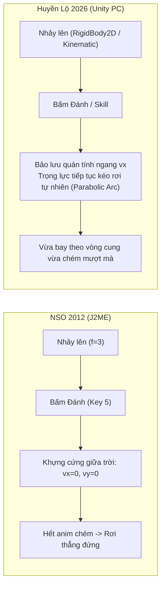
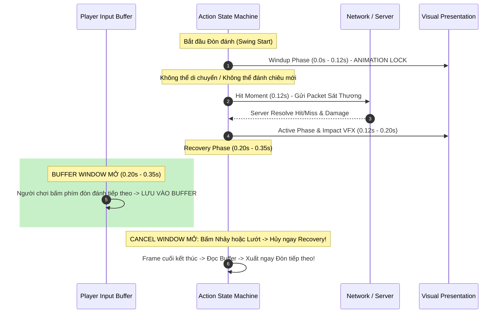
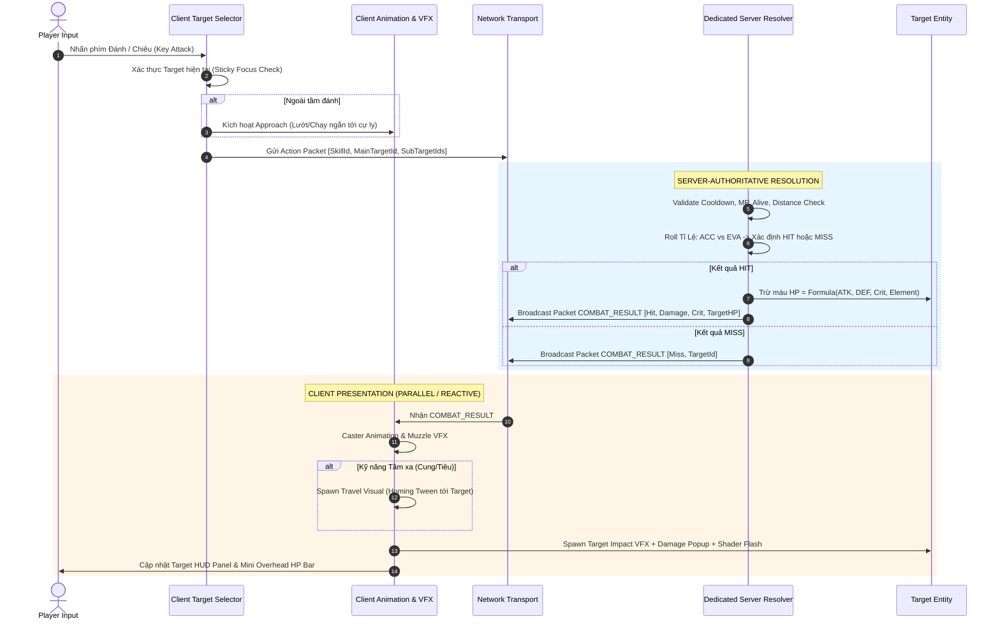
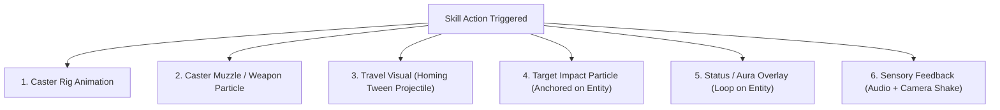

# BÁO CÁO NGHIÊN CỨU PASS 3: HIỆN ĐẠI HÓA & THIẾT KẾ KỸ THUẬT TỪ NSO SANG HUYỀN LỘ
*(NSO Modernization & Implementation Logic for Project Huyền Lộ)*

---

## 1. EXECUTIVE SUMMARY & TRIẾT LÝ HIỆN ĐẠI HÓA

### A. Định Vị Triết Lý
Huyền Lộ **KHÔNG PHẢI** là bản làm lại (remake) hay bản sao chép của Ninja School Online (NSO). NSO là một tài liệu tham chiếu sống động (reference model) đã vận hành thành công hơn một thập kỷ, chứng minh tính hiệu quả của:
1. Cơ chế chiến đấu bám mục tiêu tinh gọn (**Target-based Combat Loop**).
2. Quy tắc không gian đa tầng trực quan (**Platformer Splash Geometry**).
3. Cấu trúc bãi quái luân chuyển không thời gian chết (**Farm Pocket & Respawn Rhythm**).

Tuy nhiên, NSO ra đời vào thời kỳ điện thoại Java (J2ME), bàn phím T9, màn hình $240 \times 320$, mạng 2G GPRS và phần cứng cực kỳ nghèo nàn. Huyền Lộ được xây dựng cho thời đại mới: **PC-first, Engine Unity 6, Chuột & Bàn phím / Gamepad, Màn hình Full HD / 2K, và Kiến trúc Dedicated Server**.

### B. Nguyên Tắc Cốt Lõi Khi Kế Thừa & Hiện Đại Hóa
- **Giữ gameplay đơn giản nếu sự đơn giản đó tạo ra game feel tốt**: Không tăng độ phức tạp vật lý (realtime physics/colliders) cho các đòn đánh nếu cơ chế xúc xắc chỉ số (Target-based Stat Roll) đã giải quyết triệt để bài toán đồng bộ mạng và chống lag desync.
- **Không copy hằng số pixel thô sơ**: Chuyển đổi toàn bộ hệ tọa độ pixel cứng ($24\text{px}, 48\text{px}, 100\text{px}$) sang hệ đơn vị chuẩn thế giới Unity (**Unity World Units / Meters**) dựa trên PPU contract.
- **Tách bạch 4 cấp độ thông tin**:
  1. `[SOURCE FACT]`: Sự thật được chứng minh trực tiếp bằng mã nguồn NSO.
  2. `[DERIVED OBSERVATION]`: Quan sát suy luận hợp lý từ cấu trúc dữ liệu và mã nguồn.
  3. `[HISTORICAL INFERENCE]`: Giả thuyết bối cảnh lịch sử công nghệ 2012 (không coi là fact).
  4. `[MODERN RECOMMENDATION]`: Đề xuất kiến trúc kỹ thuật hiện đại hóa cho Huyền Lộ.

---

## 2. PLAYER DAMAGE REACTION & ACTION PRIORITY (HIT REACTION & HIT-STUN)

Đây là khoảng trống quan trọng vừa được khảo sát trực tiếp trong mã nguồn NSO Client ([`nameBK.java`](file:///home/nguyenvanrin/.gemini/antigravity-cli/brain/ebc98840-85c9-423b-a2f4-d7cc0190f869/scratch/client_decompiled/nameBK.java#L7332) và [`nameBE.java`](file:///home/nguyenvanrin/.gemini/antigravity-cli/brain/ebc98840-85c9-423b-a2f4-d7cc0190f869/scratch/client_decompiled/nameBE.java#L507)).

```
+---------------------------------------------------------------------------------------+
| SOURCE FACT: NSO XỬ LÝ NHẬN SÁT THƯƠNG NHƯ THẾ NÀO?                                   |
+---------------------------------------------------------------------------------------+
1. Hàm nhận sát thương của người chơi trong `nameBK.java`:
   `public final void a(int damage, int damageMp, boolean isCrit, int effId)` (L7332).
2. Khi bị trúng đòn:
   - `this.q -= damage;` (Trừ máu trực tiếp).
   - `this.e = (byte)4;` (Bật cờ nhấp nháy sprite đỏ trong 4 frame).
   - `nameBS.a("-" + damage, this.a, this.b - this.R, 0);` (Spawn số sát thương bay lên).
3. TUYỆT ĐỐI KHÔNG CÓ:
   - Không có Hurt State (không chuyển `this.f` sang trạng thái bị thương).
   - Không có Hit-Stun (không dừng nhân vật dù chỉ 1 frame).
   - Không ngắt chiêu (đang vung kiếm đánh thường hay cast skill thì animation vẫn chạy tiếp).
   - Không ngắt di chuyển (đang chạy hay đang rơi thì vận tốc vx, vy vẫn giữ nguyên).
4. Phân biệt với Hard CC:
   - Chỉ khi dính hiệu ứng khống chế cứng từ Boss / Phái (Choáng `f=11`, Đóng băng `f=15`, Ngủ `f=11`, hoặc Chết `f=5,14`), nhân vật mới bị khóa điều khiển và ngừng hành động.
```

### Bảng Phân Tích 10 Tình Huống Nhận Sát Thương trong NSO

| STT | Trạng thái của Thực thể | Khi Nhận Sát Thương Thường | Khi Nhận Hard CC (Choáng/Băng) | Khi Nhận Sát Thương Chết (Lethal) |
| :---: | :--- | :--- | :--- | :--- |
| **1** | **Player đang Idle** | Chớp đỏ 4 frames, nảy số máu, đứng yên tiếp tục | Ngắt Idle, vào State Choáng (`f=11`), khóa input | Chuyển ngay State Chết (`f=5` $\rightarrow$ `14`) |
| **2** | **Player đang Run** | Chớp đỏ, nảy số, chân vẫn chạy bình thường | Ngắt Run, đứng sững lại tại chỗ, dính Stun | Ngã xuống đất, vào State Chết |
| **3** | **Player đang Jump/Fall** | Chớp đỏ, nảy số, quỹ đạo rơi/nhảy không đổi | Dơi thẳng xuống đất, dính Stun tại sàn chạm | Rơi xuống đất và kích hoạt State Chết |
| **4** | **Player đang Đánh thường** | Chớp đỏ, đòn chém tiếp tục hoàn tất trọn vẹn | Ngắt đòn chém ngay lập tức, dính Stun | Hủy đòn chém, ngã gục chết |
| **5** | **Player đang Cast Skill** | Chớp đỏ, thanh tiến trình skill không bị gián đoạn | Hủy skill, mất MP, không sinh ra sát thương | Hủy skill, vào State Chết |
| **6** | **Player nhận nhiều Hit liên tiếp** | Chớp đỏ liên tục (reset timer chớp), không bị khựng | Thời gian CC được cộng dồn hoặc refresh | Chết ngay ở hit làm HP $\le 0$ |
| **7** | **Mob đang Idle** | Chớp trắng/đỏ, nảy số máu, không bị đẩy lui | Đứng im dính Stun | Chết, rơi đồ, kích hoạt timer hồi sinh |
| **8** | **Mob đang Move (Patrol)** | Chớp màu, tiếp tục bước đi tuần tra bình thường | Ngừng di chuyển tại chỗ | Chết ngay lập tức |
| **9** | **Mob đang Attack** | Chớp màu, đòn đánh vẫn tung ra gây sát thương | Ngắt đòn đánh của quái | Hủy đòn đánh, ngã gục |
| **10**| **Mob nhận Lethal Damage** | Chết ngay frame bóc packet `NPC_DIE` | N/A | Server xóa khỏi danh sách sống, Client play die anim |

### Bảng Ưu Tiên Hành Động (Action Priority Matrix)
Từ mã nguồn NSO, ta dựng được Ma trận Ưu tiên Thực thi (Priority Hierarchy):
$$\mathbf{Death\ (Tử\ vong)} > \mathbf{Hard\ CC\ (Choáng/Băng)} > \mathbf{Current\ Attack/Skill} > \mathbf{Locomotion\ (Di\ chuyển)} > \mathbf{Idle}$$
*Đặc biệt*: Sát thương thông thường (Normal Damage) **nằm ngoài hệ thống State**, chỉ là một sự kiện trừ chỉ số (Stat Event) đi kèm phản hồi hình ảnh (Cosmetic Feedback).

### Đề Xuất Hiện Đại Hóa Cho Huyền Lộ (Modern Recommendation)
- **ÁP DỤNG NGUYÊN TẮC NSO**: Đòn đánh thường từ quái vật **KHÔNG ĐƯỢC PHÉP gây Hit-Stun người chơi**.
  - *Lý do*: Trong game ARPG cày quái màn hình ngang, người chơi thường xuyên gom 4–6 quái lại để quét chiêu. Nếu mỗi cú cắn của quái gây khựng 0.1s, người chơi sẽ rơi vào trạng thái "Hit-Stun Lock" (liệt phím không thể tung chiêu hay nhảy thoát), gây ức chế tột độ.
- **Hiện đại hóa Phản hồi Giác quan (Juice / Feedback)**:
  - Dù không có Hit-Stun logic, đòn đánh trúng người chơi vẫn phải có cảm giác lực tốt nhờ:
    1. *Shader Flash*: Nháy sáng trắng/đỏ trên sprite trong $0.08\text{s}$ (không làm gián đoạn sprite animation).
    2. *Micro Screen Shake*: Rung nhẹ camera $0.05\text{s}$ khi nhận sát thương bạo kích (Critical).
    3. *Audio Impact*: Âm thanh trúng đòn đanh thép theo chất liệu giáp (Kim loại / Vải / Da).
    4. *Floating Combat Text*: Số sát thương nảy lên với màu sắc phân biệt rõ ràng.
- **Đòn đánh gây ngắt chiêu (Interrupt Attacks)**: Chỉ có các kỹ năng đặc biệt của Quái Tinh Anh / Thủ lĩnh / Boss (có báo trước vùng đỏ Telegraph) mới được quyền kích hoạt trạng thái Ngắt chiêu hoặc Đẩy lùi (Knockback).

---

## 3. JUMP ATTACK & AERIAL COMBAT (CHIẾN ĐẤU TRÊN KHÔNG)

```
+---------------------------------------------------------------------------------------+
| SOURCE FACT: NSO XỬ LÝ NHẢY ĐÁNH NHƯ THẾ NÀO?                                         |
+---------------------------------------------------------------------------------------+
1. File `nameBS.java` lines 2721–2725:
   `else if (nameBK.a().f == 3) { if (nameCX.a[5]) { nameCX.a[5] = false; this.b(false); } }`
   -> NSO HOÀN TOÀN CHO PHÉP TẤN CÔNG KHI ĐANG NHẢY (f=3) VÀ ĐANG RƠI (f=4)!
2. Cơ chế vật lý khi xuất chiêu trên không (`nameBK.java` L1693):
   `this.f = 6; this.c = 0; this.d = 0;`
   -> Nhân vật DỪNG TOÀN BỘ vận tốc ngang (vx=0) và vận tốc dọc (vy=0)!
   -> Nhân vật bị "khựng cứng" lơ lửng giữa không trung trong suốt thời gian diễn hoạt đòn chém.
3. Sau khi chém xong:
   `nameBK.java` L1635: `this.f = 4; this.d = 1;`
   -> Nhân vật chuyển sang trạng thái Rơi (f=4) và rơi tự do chạm đất.
4. Bounding Box & Target trên không:
   -> Tính toán khoảng cách dùng tọa độ thực tại thời điểm chém: `Math.abs(player.y - mob.y)`.
   -> Khi nhảy lên cao, player.y tiệm cận độ cao của quái bay, cho phép chém trúng quái bay mà không cần chờ nó sà xuống!
```

### Đánh Giá & Hiện Đại Hóa Cho Huyền Lộ



- **HISTORICAL INFERENCE**: NSO phải gán `vx=0, vy=0` khi chém trên không vì hệ thống animation J2ME thời đó chỉ có 1 kênh diễn hoạt sprite frame duy nhất, không có blending và không tính toán được va chạm sàn nếu nhân vật vừa chém vừa rơi ở tốc độ cao.
- **MODERN RECOMMENDATION CHO HUYỀN LỘ**:
  - **Cho phép Nhảy Đánh Đầy Đủ (Full Aerial Attack)**: Người chơi có thể dùng đòn đánh thường và các kỹ năng cấp thấp (kỹ năng không yêu cầu niệm chú) khi đang ở trên không.
  - **Bảo lưu Động lượng (Momentum Preservation)**: Nhân vật không bị khựng đơ giữa trời. Vận tốc ngang ($v_x$) và gia tốc trọng lực ($v_y$) tiếp tục được tính toán tự nhiên, nhân vật vừa lướt theo đường parabol vừa tung đường kiếm chém quái.
  - **Tương tác Quái Bay (Ong Giáp)**:
    - Đây là cơ chế đối trọng hoàn hảo: Người chơi kỹ năng cao không cần thụ động đứng chờ Ong Giáp sà xuống, mà có thể chủ động **Nhảy lên chém đón đầu** (Intercept Jump Attack).

---

## 4. INPUT BUFFER, ANIMATION LOCK & ACTION CANCEL

### A. So sánh Cơ Chế Tiếp Cận & Ra Chiêu (Auto-Approach & Cast)
Trong Pass 2, chúng ta đã chứng minh NSO có sự phân hóa:
- Nhấn 1 lần ngoài tầm: Chạy tới nơi $\rightarrow$ Hết buffer $\rightarrow$ Dừng lại $\rightarrow$ Phải nhấn lần 2 mới đánh.
- Giữ nút hoặc Bật Auto: Tự động chạy tới và kích hoạt đòn đánh ngay khi vào tầm.

```
+---------------------------------------------------------------------------------------------------+
| ĐÁNH GIÁ 3 PHƯƠNG ÁN UX CHO HUYỀN LỘ (PC-FIRST)                                                   |
+---------------------------------------------------------------------------------------------------+
Phương án 1 (Giữ nguyên NSO Legacy):
- Nhấn phím ngoài tầm -> Chạy tới -> Đứng yên -> Bấm lần 2 để đánh.
- Nhược điểm: Trên PC, người chơi sẽ cảm thấy phím bấm bị "nuốt" (input dropped), combat bị gắt gỏng.

Phương án 2 (Approach and Cast tự động hoàn toàn):
- Nhấn phím 1 lần -> Tự chạy tới -> Tự xuất chiêu ngay khi chạm tầm.
- Ưu điểm: Rất mượt mà cho trải nghiệm nhập vai.
- Rủi ro: Nếu quái ở quá xa, nhân vật tự chạy một quãng dài có thể làm người chơi cảm thấy mất kiểm soát.

Phương án 3 (HYBRID - ĐỀ XUẤT CHO HUYỀN LỘ):
- Nhấn Tap nhanh khi mục tiêu trong tầm: Xuất chiêu tức thì.
- Nhấn Tap khi mục tiêu NGOÀI TẦM NHƯNG TRONG BÁN KÍNH HỢP LÝ (<= 4.0 Unity units):
  -> Nhân vật tự động bước nhanh/lướt tới và tự động tung chiêu (Approach & Cast).
- Nếu mục tiêu QUÁ XA (> 4.0 units): Báo hiệu "Mục tiêu ngoài tầm" trên HUD, không tự chạy rông khắp map.
- MỌI PHÍM DI CHUYỂN (A/D/Trái/Phải/Nhảy/Lướt) SẼ HỦY LẬP TỨC TIẾN TRÌNH AUTO-APPROACH.
```

### B. Input Buffer & Animation Lock Timeline



- **Thời lượng Bộ đệm Đòn đánh (Input Buffer Window)**: Đề xuất **$150\text{ms} - 200\text{ms}$** (chuẩn mực của game ARPG hiện đại). Cho phép người chơi bấm trước đòn đánh tiếp theo trong lúc đòn đánh hiện tại đang trong giai đoạn hồi phục (Recovery).
- **Hủy Động Tác (Cancel Rules)**:
  - *Giai đoạn Vung đòn (Windup)*: Khóa cứng, không thể cancel để đảm bảo tính kỷ luật của đòn đánh.
  - *Giai đoạn Hồi chiêu/Thu kiếm (Recovery)*: Cho phép **Dash-Cancel** hoặc **Jump-Cancel** để người chơi né đòn kịp thời.

---

## 5. HỆ QUY CHIẾU & MÔ HÌNH TỌA ĐỘ CHUẨN TRÊN UNITY (UNITY COORDINATE MODEL)

NSO vận hành hoàn toàn trên hệ tọa độ Pixel nguyên bản của màn hình nhỏ ($24\text{px}$ tile, $48\text{px}$ spacing, $100\text{px}$ splash). Huyền Lộ có hợp đồng asset: **PPU = 32** (32 pixels = 1.0 Unity World Unit / 1 Meter).

### Bảng Chuyển Đổi Không Gian Chuẩn: Từ NSO Pixel sang Unity World Units

| Khái niệm Gameplay | Giá trị Pixel NSO (Reference) | Bản chất Cơ học | Giá trị Chuẩn Hóa trên Unity (Huyền Lộ) | Ghi chú Thiết kế |
| :--- | :--- | :--- | :--- | :--- |
| **Kích thước 1 Tile** | $24 \times 24\text{px}$ | Khối địa hình cơ bản | **$1.0\text{ u} \times 1.0\text{ u}$** (Sprite $32\text{px}$) | Chuẩn grid thế giới |
| **Chiều cao Nhân vật** | $32\text{px}$ | Chiều cao sprite nam | **$1.5\text{ u}$** (Sprite body $48\text{px}$) | Tỷ lệ cơ thể chuẩn |
| **Bước nhảy Platform ($\Delta Y$)** | $48\text{px}$ (2 tiles NSO) | Độ cao giữa 2 tầng sàn liền kề | **$2.0\text{ u}$** (đúng 2 tiles Unity) | Nhảy 1 nhịp nhẹ là chạm sàn trên |
| **Tầm đánh Cận chiến ($dx$)** | $45\text{px}$ | Tầm chém kiếm cơ bản | **$1.5\text{ u} - 1.8\text{ u}$** | Khoảng cách chạm mặt kiếm |
| **Dung sai Dọc Cận chiến ($dy$)** | $30\text{px}$ | Độ lệch trục Y cho phép chém | **$1.0\text{ u}$** | Chém trúng khi đứng lệch nhẹ |
| **Bán kính Lan Ngang ($Splash_X$)** | $100\text{px}$ quanh target chính | Quét mục tiêu phụ theo chiều ngang | **$3.0\text{ u} - 3.5\text{ u}$** | Bao trọn 1 cụm quái 3–4 con |
| **Bán kính Lan Dọc ($Splash_Y$)** | $50\text{px}$ quanh target chính | Quét mục tiêu phụ lên tầng trên/dưới | **$2.2\text{ u}$** | **$2.2\text{ u} > 2.0\text{ u}$**: Đảm bảo lan tầng! |
| **Tầm đánh Tầm xa (Cung/Tiêu)** | $180\text{px} - 250\text{px}$ | Tầm bắn xa cơ bản | **$6.0\text{ u} - 8.0\text{ u}$** | Bằng 1/2 màn hình Full HD |
| **Biên độ Tuần tra Quái (`rangeMove`)** | $100\text{px} - 150\text{px}$ | Bán kính đi lại quanh spawn | **$3.5\text{ u} - 4.5\text{ u}$** | Giữ quái trong phạm vi cụm |

### Kiến Trúc Tách Rời: Transform Presentation vs Gameplay Logic Position
- **Quy tắc Vàng**: **Không dùng trực tiếp `UnityEngine.Transform.position` làm dữ liệu chân lý (authority) trên Server**.
- **Mô hình triển khai**:
  - Dữ liệu Gameplay trên Server: Lưu trữ dưới dạng cấu trúc tọa độ `Vector2` logic thuần túy (float precision), cập nhật theo Fixed Timestep ($50\text{Hz}$ / $20\text{ms}$).
  - Client Presentation: Component `Transform` của Unity chỉ đóng vai trò hiển thị. Nó sử dụng phép nội suy mượt mà (**Hermite Interpolation / Lerp**) bám theo tọa độ logic nhận được từ Server để triệt tiêu hiện tượng giật hình (jitter) giữa các frame render.

---

## 6. MOB SERVER AUTHORITY: SO SÁNH 3 MÔ HÌNH KIẾN TRÚC

```
+-----------------------------------------------------------------------------------------------------------------+
| PHÂN TÍCH 3 MÔ HÌNH SERVER AUTHORITY CHO QUÁI VẬT                                                               |
+-----------------------------------------------------------------------------------------------------------------+
MODEL A: NSO Legacy Spawn-Anchor Authority
- Mô tả: Server ghim cứng tọa độ (x,y) tại điểm spawn gốc. Mọi chuyển động đi tuần, quay đầu là Client tự diễn.
- Ưu điểm: Tiết kiệm 99% CPU Server và băng thông mạng.
- Nhược điểm: Không hỗ trợ quái bị đẩy lùi (knockback), quái bị người chơi kéo đi xa (kite) sẽ bị desync vị trí nặng.

MODEL B: Full Unity 2D Physics Server
- Mô tả: Server chạy toàn bộ Rigidbody2D, Dynamic Forces, BoxCollider2D cho từng con quái.
- Ưu điểm: Tính vật lý chân thực cao.
- Nhược điểm: Chi phí CPU máy chủ cực lớn khi có 500-1000 quái trong world; dễ gặp lỗi vật lý trôi dạt (physics drift)
  và lag compensation cực kỳ phức tạp.

MODEL C: Lightweight Kinematic Authoritative Simulation (ĐỀ XUẤT CHO HUYỀN LỘ)
- Mô tả: Server chạy mô phỏng chuyển động nhẹ (Kinematic Vector2):
  + Quái tuần tra: `x += speed * dir * dt`.
  + Gặp mép sàn hoặc chạm tường: Kiểm tra Tilemap boolean query đơn giản -> Đảo hướng.
  + Đẩy lùi (Knockback): Gán xung lực vận tốc giảm dần `velocity += impulse`.
  + Gửi snapshot vị trí quái ở tần số thấp (10-20 Hz). Client nội suy vị trí mượt mà.
- Đánh giá: Cân bằng hoàn hảo giữa tính chân thực (anti-cheat, vị trí thật, knockback) và hiệu năng máy chủ.
```

### Bảng So Sánh Chi Tiết Giữa 3 Mô Hình

| Tiêu chí Đánh giá | MODEL A (NSO Legacy) | MODEL B (Full Physics Server) | MODEL C (Lightweight Kinematic Server) |
| :--- | :--- | :--- | :--- |
| **Tải CPU Server (500 Mobs)** | Cực thấp ($\approx 1\%$) | Cực cao ($\approx 60-80\%$) | **Rất thấp ($\approx 5-8\%$)** |
| **Băng thông Mạng (Bandwidth)** | Gần như bằng 0 | Rất cao | **Thấp (nén delta snapshot 10Hz)** |
| **Hỗ trợ Đẩy lùi (Knockback)** | Hoàn toàn KHÔNG | Rất tốt | **Rất tốt (Kinematic Impulse)** |
| **Độ nhất quán Multiplayer** | Trung bình (quái lệch vị trí nhỏ) | Cao | **Rất cao (Đồng bộ vị trí chuẩn)** |
| **Khả năng mở rộng Boss Phase** | Kém | Phức tạp | **Rất tốt và dễ mở rộng** |
| **Rủi ro Viết lại Code (Rewrite)**| Cao khi làm Boss phức tạp | Cực cao do physics bugs | **Thấp nhất (Deterministic Math)** |

---

## 7. TARGET-BASED COMBAT TRÊN UNITY HIỆN ĐẠI

### A. Luồng Xử Lý Trọn Vẹn (Complete Execution Pipeline)



### B. Những Thành Phần KHÔNG CẦN và NÊN BỎ trong Combat
- **KHÔNG DÙNG**: Projectile Rigidbody2D bay vật lý để kích nổ sát thương khi chạm collider quái.
- **KHÔNG DÙNG**: Realtime Hitbox/Hurtbox va chạm động giữa vũ khí và cơ thể nhân vật.
- **KHÔNG DÙNG**: Client-side Damage Authority (Client tuyệt đối không tự tính sát thương rồi gửi lên server).
- **CHỈ DÙNG PHIÊN BẢN GỌN NHẸ CỦA PHYSICS2D**:
  - Dùng để xác định mặt sàn đất (`GroundCheck` via Raycast2D).
  - Dùng để xử lý rơi xuyên sàn One-way (`PlatformEffector2D`).
  - Dùng để kiểm tra vật cản tầm nhìn (`LineOfSight` raycast).

---

## 8. TERRAIN & LINE OF SIGHT (TẦM NHÌN ĐỊA HÌNH TRONG COMBAT)

### So Sánh 3 Lựa Chọn & Khuyến Nghị

```
+---------------------------------------------------------------------------------------------------+
| LỰA CHỌN A: NSO Legacy (Bỏ qua Địa hình hoàn toàn)                                                |
| - Mũi tên và chiêu thức bắn xuyên qua mọi bức tường đá dày, trần hang, sàn đất.                  |
| - Đánh giá: Quá phi lý và thô sơ đối với đồ họa PC hiện đại.                                     |
+---------------------------------------------------------------------------------------------------+
| LỰA CHỌN B: Solid-Wall LOS Filter (ĐỀ XUẤT CHO HUYỀN LỘ)                                          |
| - Tường đá dày / Khối địa hình Solid ngăn cản đường đạn tầm xa.                                  |
| - Platform mỏng / Sàn One-way KHÔNG ngăn cản: Đạn và chiêu lan vẫn xuyên qua các sàn nhảy mỏng.    |
| - Đánh giá: Giữ trọn vẹn cảm giác combat đa tầng kinh điển của NSO (quét quái tầng trên/dưới),     |
|   nhưng loại bỏ hoàn toàn sự vô lý khi bắn xuyên tường hang động kín.                             |
+---------------------------------------------------------------------------------------------------+
| LỰA CHỌN C: Full Raycast Geometry (Mọi vật cản đều chặn)                                          |
| - Bất kỳ gờ đá, nhánh cây hay sàn mỏng nào cũng chặn đạn.                                         |
| - Đánh giá: Gây ức chế nặng nề trong game màn hình ngang, phá vỡ tính năng lan tầng của kỹ năng. |
+---------------------------------------------------------------------------------------------------+
```

- **TRẠNG THÁI KHÓA**: **LOCK CANDIDATE $\rightarrow$ Lựa chọn B (Solid-Wall LOS Filter)**.
  - Sử dụng Layer Mask: Chỉ bắn raycast kiểm tra va chạm với layer `SolidGround` (tường bao map). Bỏ qua hoàn toàn layer `OneWayPlatform`.

---

## 9. THIẾT KẾ GIAO DIỆN MỤC TIÊU PC-FIRST (MODERN TARGET UI)

Khác với màn hình di động nhỏ hẹp của NSO, màn hình PC Full HD / 2K có diện tích hiển thị lớn. Tuy nhiên, nguyên tắc cốt tử là **tránh biến màn hình thành một đống rác giao diện (UI Clutter)** khi người chơi giao chiến với cả đàn quái vật.

```
                                  MÀN HÌNH PC FULL HD (1920 x 1080)
+-----------------------------------------------------------------------------------------------+
| [PLAYER HUD]                                     [TARGET HUD PANEL]                           |
| Avatar | HP: 1250/1250                           [Icon Hệ Thổ] HẮC LANG - CẤP 12             |
| Level 10 | MP: 450/450                           HP: [========================] 480/480       |
|                                                  Buffs: [Giảm Giáp 5s] [Bỏng 3s]              |
|                                                                                               |
|                                                                                               |
|                                                                                               |
|                                                                                               |
|                       (Quái Không Focus)                 ▼ [Mũi Tên Vàng Mini]                |
|                            [Sói Xám]                    === [HP Mini Bar 30px]                |
|                         (Không HP Bar)                       [SÓI ĐẦU ĐÀN]                    |
|                                                              (ĐANG FOCUS)                     |
|                                                                                               |
|       [PLAYER CHARACTER]                                                                      |
|===============================================================================================|
```

### Phân Tầng Thông Tin Giao Diện (Information Hierarchy)

1. **Không gian Thế giới (World-Space Presentation)**:
   - **Chỉ hiển thị trên đầu Quái đang nhận Focus**:
     - Mũi tên tam giác chỉ thị mục tiêu thanh mảnh.
     - Thanh máu mini (Overhead Mini HP Bar, bề rộng $\approx 30-40\text{px}$, chiều cao $4\text{px}$).
   - **Toàn bộ quái xung quanh (Unfocused Mobs)**:
     - Mặc định **KHÔNG HIỂN THỊ** thanh máu hay tên để giữ khung cảnh chiến đấu trong trẻo.
     - *Ngoại lệ*: Chỉ hiện thanh máu mờ ngắn khi quái đó vừa bị nhận sát thương trong vòng $2\text{s}$ (Damage Feedback Indicator), sau đó tự mờ dần và biến mất.

2. **Khung Thông Tin Cố Định Màn Hình (Screen-Space Target HUD)**:
   - Bố trí cố định tại góc trên màn hình (cạnh hoặc đối xứng với Player HUD):
     - Tên đầy đủ + Cấp độ + Phân cấp (Thường / Tinh Anh / Thủ Lĩnh / Linh Biến).
     - Biểu tượng Hệ Nguyên Tố (Hỏa / Thủy / Lôi / Phong / Thổ).
     - Thanh HP lớn hiển thị chính xác con số: `480 / 480 (100%)`.
     - Hàng biểu tượng Trạng Thái (Status Icons: Bỏng, Choáng, Đóng băng) kèm đồng hồ đếm lùi thời gian còn lại.

---

## 10. KIẾN TRÚC HIỆU ỨNG HÌNH ẢNH HIỆN ĐẠI (VFX ARCHITECTURE)

Huyền Lộ nâng cấp mô hình 4 lớp của NSO thành kiến trúc 6 thành phần hoàn chỉnh trên Unity:



### Tối Ưu Hóa Kỹ Thuật trên Unity:
- **Object Pooling Bắt Buộc**: Sử dụng `UnityEngine.Pool.ObjectPool<GameObject>` cho toàn bộ Travel Visual (đạn), Impact Particles và Floating Damage Texts. Đảm bảo **Zero GC Allocation** trong suốt quá trình người chơi cày cuốc liên tục.
- **Sorting Layers**:
  - `Background` $\rightarrow$ `Terrain` $\rightarrow$ `Characters/Mobs` $\rightarrow$ `SkillVFX_Bottom` $\rightarrow$ `SkillVFX_Top` $\rightarrow$ `DamageNumbers` $\rightarrow$ `ScreenUI`.
- **Độ Lệch Diễn Hoạt Khi Đánh Lan (Multi-target Staggered Presentation)**:
  - Dù Server trừ máu toàn bộ 3–4 quái trong cùng 1 tick, Client có thể phân phối thời điểm nổ của Travel Visual tới các quái phụ trễ hơn quái chính $0.03\text{s} - 0.06\text{s}$ (1–2 frames) để tạo nhịp điệu va chạm giòn giã, đã mắt đã tai hơn.

---

## 11. CẤU TRÚC MAP, BÃI FARM & ĐỐI CHIẾU CHU KỲ RESPAWN (12s vs 25s)

### A. Công Thức Thiết Kế Bãi Quái (Farm Pocket Derivation)
Từ các quan sát thực nghiệm ở Pass 2, ta xây dựng bộ công thức toán học để đội ngũ Level Design thiết kế mọi map cày cuốc trong Huyền Lộ:
1. **Số lượng Quái trong 1 Cụm ($N_{mob}$)**:
   $$N_{mob} = \text{maxTargets của Kỹ năng Quét Lan} \approx 3 - 4\text{ con}$$
2. **Khoảng cách Quái trong Cụm ($D_{inner}$)**:
   $$D_{inner} \le \frac{\text{Bán kính Splash ngang}}{N_{mob}} \approx 0.8\text{ u} - 1.2\text{ u} \text{ (24–36 pixels)}$$
3. **Cự ly giữa 2 Cụm Liền Kề ($D_{pocket}$)**:
   $$D_{pocket} = v_{run} \times t_{run} \approx 4.0\text{ u/s} \times 2.0\text{s} \approx 8.0\text{ u} - 10.0\text{ u}$$

---

### B. Đối Chiếu Chuyên Sâu: Chu Kỳ Hồi Sinh 12s của NSO vs 25s của Huyền Lộ

```
+---------------------------------------------------------------------------------------------------+
| BẢNG ĐỐI CHIẾU CHU KỲ FARM LOOP                                                                   |
+---------------------------------------------------------------------------------------------------+
NSO (12s Respawn Baseline):
- Thời gian diệt 1 cụm (TTK): 2 - 3 giây.
- Thời gian chạy giữa 2 cụm: 2 giây.
- Vòng tuần hoàn: Chỉ cần 3 Pockets (A -> B -> C -> Quay lại A = vừa vặn 12 giây).
- Đánh giá: Nhịp độ farm cực nhanh, kích thích cao, phù hợp bản đồ ngắn và gameplay di động.

HUYỀN LỘ (25s Baseline hiện tại trong GDD §3 / §6):
- Thời gian diệt 1 cụm (TTK theo GDD): 3 - 5 giây.
- Thời gian nhặt đồ + hồi phục: 2 - 3 giây.
- Thời gian chạy giữa 2 cụm: 2 - 3 giây.
- Nếu chỉ có 3 cụm: Tổng thời gian = (4s + 2s + 3s) * 3 = 27 giây -> Vừa khít chu kỳ 25s!
```

- **KẾT LUẬN & ĐỀ XUẤT CHO HUYỀN LỘ**:
  - **GIỮ NGUYÊN BASELINE 25s CỦA HUYỀN LỘ** (không vội vàng hạ xuống 12s như NSO).
  - *Lý do*: Trong Huyền Lộ, quái có máu dày hơn, TTK dài hơn (3–5s so với 2s của NSO), và người chơi có hành vi nhặt đồ/kiểm tra chiến lợi phẩm. Chu kỳ 25s trên bản đồ bố trí **3 đến 4 cụm quái** sẽ tạo ra một vòng di chuyển vừa vặn, không bị đứt đoạn.
  - *Prototype Gate*: Đưa thông số `RespawnTimer` thành biến config tập trung trên Server (`[Range: 18s - 25s - 30s]`) để tinh chỉnh chính xác qua các đợt playtest thực tế.

---

## 12. PHÂN HÓA HÀNH VI 3 ARCHETYPE QUÁI VẬT HIỆN ĐẠI

| Archetype Quái | Hành vi Tuần tra (Patrol / Idle) | Hành vi Khi Phát hiện Người chơi | Hành vi Khi Người chơi ở Khác Tầng | Cơ chế Đòn đánh |
| :--- | :--- | :--- | :--- | :--- |
| **1. Ground Melee** *(Sói, Heo rừng, Thạch)* | Đi tuần ngang quanh spawn ($X \pm 3.5\text{ u}$). Chạm mép sàn thì tự quay đầu. | Tiếp cận người chơi trên cùng sàn. | Không nhảy tầng đuổi theo (giữ đơn giản NSO), nhưng **bật trạng thái cảnh giác** hoặc lùi nhẹ vào góc khuất thay vì đứng yên làm bia. | Đòn chém cận chiến có telegraph nhẹ. |
| **2. Ground Ranged** *(Nhím gai, Cóc tía)* | Đi tuần chậm hoặc đứng rình rập tại các gờ đá cao. | Khóa mục tiêu trong tầm $6.0\text{ u}$. | **Bắn tỉa xuyên tầng**: Bắn người chơi ở tầng trên/dưới nếu không bị tường đá solid che chắn. | Bắn đạn generic presentation (cầu gai, tia độc). Damage resolve tức thì trên server. |
| **3. Flying** *(Ong Giáp)* | Bay lơ lửng ở cao độ an toàn ($Y_{spawn} + 2.0\text{ u}$ so với sàn). | Bám theo người chơi theo hình học 2D. | Bay lượn tự do qua lại giữa các tầng platform. | **Swoop Down Attack**: Khi tấn công, chúc đầu sà xuống cự ly ngang người chơi ($Y - 0.8\text{ u}$), tạo cửa sổ để cận chiến chém phản đòn. |

---

## 13. AUDIT TOÀN BỘ CÁC GIẢ THUYẾT LỊCH SỬ (LEGACY ASSUMPTION AUDIT)

Để đảm bảo mô hình Design Lock tiếp theo không bị ngộ nhận giữa "sự thật mã nguồn" và "suy đoán lịch sử", chúng tôi phân loại và thẩm định lại toàn bộ các phát biểu từ Pass 1 và Pass 2:

| Phát biểu Nghiên cứu từ Pass 1 & 2 | Phân loại Thẩm định | Bằng chứng / Cơ sở Đánh giá |
| :--- | :---: | :--- |
| *"NSO resolve sát thương bằng Stat Roll, không dùng physics projectile"* | **SOURCE PROVEN** | [`Char.java`](file:///home/nguyenvanrin/PersonalProjects/rpg-online/research/SRC%20NSOACE%20FIX/src/com/nsoz/model/Char.java#L6744) và [`Service.java`](file:///home/nguyenvanrin/PersonalProjects/rpg-online/research/SRC%20NSOACE%20FIX/src/com/nsoz/network/Service.java#L811): Trừ máu tức thì khi bóc gói tin, không sinh đạn server. |
| *"Target selection của NSO có tính chất Sticky tuyệt đối"* | **SOURCE PROVEN** | [`nameBK.java`](file:///home/nguyenvanrin/.gemini/antigravity-cli/brain/ebc98840-85c9-423b-a2f4-d7cc0190f869/scratch/client_decompiled/nameBK.java#L6460): Kiểm tra `mobFocus` còn trong tầm là `return;` ngay, không quét con khác. |
| *"Khoảng cách tầng 48px cố ý để skill lan 50px đánh trúng cả 2 tầng"* | **SOURCE PROVEN** | Đối chiếu hình học: $\Delta Y = 48\text{px}$ trong `Data/Map/50` và ngưỡng splash $50\text{px}$ trong `nameBK.java` L1910. |
| *"Server không cập nhật tọa độ quái thời gian thực, ghim tại spawn"* | **SOURCE PROVEN** | [`Mob.java`](file:///home/nguyenvanrin/PersonalProjects/rpg-online/research/SRC%20NSOACE%20FIX/src/com/nsoz/mob/Mob.java#L1010): Hàm `update()` không hề thay đổi `this.x, this.y` của quái. |
| *"NSO làm server tĩnh và không physics vì CPU máy chủ và mạng GPRS yếu"* | **PLAUSIBLE INFERENCE** | Suy luận kỹ thuật hợp lý dựa trên hạ tầng di động 2012, nhưng trong comment source không ghi rõ lý do này. |
| *"NSO không có phím Tab cycle target vì bàn phím T9 không đủ nút"* | **PLAUSIBLE INFERENCE** | Bàn phím chuẩn J2ME chỉ có 12 phím cơ bản, không có phím chức năng phụ trợ. |
| *"Đòn đánh xuyên tường vì game thời đó không có công nghệ raycast"* | **PLAUSIBLE INFERENCE** | Các game J2ME thời 2010 hầu hết chỉ xử lý tile collision đơn giản trên chuyển động, bỏ qua raycast đạn. |

---

## 14. MODERNIZATION GAPS & RỦI RO KỸ THUẬT CẦN PROTOTYPE SỚM

1. **Rủi ro Cảm giác Điều khiển trên PC (Game Feel / Controls)**:
   - Cơ chế Approach & Cast kết hợp Input Buffer $150\text{ms}$ cần được kiểm chứng cảm giác bấm thực tế trên bàn phím/chuột trong Prototype Phase 1 (LocalAuthority).
2. **Rủi ro Đồng bộ Vị trí Quái Kinematic (Model C)**:
   - Cần kiểm tra thuật toán nội suy Client xem có bị hiện tượng quái giật cục (snapping) khi mạng có độ trễ $80-100\text{ms}$ hay không.
3. **Rủi ro Bắn tỉa qua Tường (Solid LOS)**:
   - Cần đảm bảo hệ thống Tilemap Collider tách bạch chuẩn xác giữa `SolidGround` và `OneWayPlatform` để tránh lỗi đạn bị chặn bởi các bậc thang nhảy mỏng.

---

## 15. CẨM NANG TRIỂN KHAI THỰC CHIẾN TỐI GIẢN CHO DEV (PONYTAIL INDIE RECIPES)

> [!TIP]
> **Triết lý Ponytail ("Lười nhưng đúng - YAGNI")**:
> Không xây dựng hệ thống phức tạp khi mã nguồn chuẩn 5–15 dòng của Unity/C# đã giải quyết triệt để vấn đề. Dưới đây là các "công thức nấu ăn" (recipes) tối giản nhất để nhóm lập trình triển khai ngay trong Phase 1 Prototype mà không bị over-engineering.

### Recipe 1: Mob Kinematic Movement & Knockback trên Dedicated Server (Model C - 6 dòng C#)
*Vấn đề*: Không cần NavMesh, không cần Rigidbody2D, không raycast tìm đường.
*Giải pháp*: Kẹp vị trí quái trong khoảng $X \in [minX, maxX]$ trên sàn hiện tại. Knockback chỉ là vận tốc suy giảm dần.
```csharp
// Chạy trên Dedicated Server Tick (ví dụ 20Hz / dt = 0.05f)
void ServerMobTick(Mob mob, float dt) {
    // 1. Phục hồi Knockback hoặc đi tuần tự nhiên
    if (Mathf.Abs(mob.vx) > 0.1f) {
        mob.x += mob.vx * dt;
        mob.vx = Mathf.MoveTowards(mob.vx, 0f, 15f * dt); // Suy giảm ma sát knockback
    } else {
        mob.x += mob.patrolSpeed * mob.dir * dt;
    }
    // 2. Chạm mép sàn là đổi hướng ngay lập tức (1D Horizontal Clamp)
    if (mob.x >= mob.maxX) { mob.x = mob.maxX; mob.dir = -1; }
    else if (mob.x <= mob.minX) { mob.x = mob.minX; mob.dir = 1; }
}
```

---

### Recipe 2: Nhảy Đánh (Jump Attack - 3 dòng C#)
*Vấn đề*: Cho phép chém quái bay khi đang nhảy mà không cần máy trạng thái phức tạp.
*Giải pháp*: Khi bấm đánh lúc đang trên không, chỉ kích hoạt animation chém; giữ nguyên vận tốc bay ngang và rơi trọng lực tự nhiên.
```csharp
void TryAirAttack() {
    if (!isGrounded && CanAttack()) {
        animator.Play("AirAttack"); // Chỉ đổi clip diễn hoạt vũ khí
        TriggerSkill(currentSkill);  // Server/Client tính hit dựa trên transform.position.y hiện tại
        // KHÔNG gán velocity = Vector2.zero -> Người chơi tiếp tục bay theo quán tính!
    }
}
```

---

### Recipe 3: Sticky Target Focus & Phím Tab Cycle (12 dòng C#)
*Vấn đề*: Quái chạy qua lại không được làm nhảy con trỏ liên tục; đồng thời hỗ trợ phím Tab chuyển mục tiêu trên PC.
*Giải pháp*: Giữ nguyên mục tiêu cũ nếu còn sống và trong tầm mở rộng. Nếu mất hoặc bấm Tab thì quét con kế tiếp.
```csharp
Mob GetOrUpdateTarget(List<Mob> activeMobs, Mob current, Vector2 pPos, bool tabPressed) {
    if (!tabPressed && current != null && current.IsAlive && Vector2.Distance(pPos, current.Pos) <= 7.0f)
        return current; // Sticky tuyệt đối!

    // Quét mục tiêu hợp lệ gần nhất hoặc xoay vòng theo Tab
    var inRange = activeMobs.Where(m => m.IsAlive && Vector2.Distance(pPos, m.Pos) <= 6.0f).OrderBy(m => Vector2.Distance(pPos, m.Pos)).ToList();
    if (inRange.Count == 0) return null;
    if (!tabPressed || current == null) return inRange[0];

    int nextIdx = (inRange.IndexOf(current) + 1) % inRange.Count;
    return inRange[nextIdx];
}
```

---

### Recipe 4: Visual Homing Projectile (12 dòng C#)
*Vấn đề*: Hiệu ứng đạn bay dí theo quái mượt mà nhưng không được dùng Physics Collider / Rigidbody.
*Giải pháp*: Đạn thuần túy là Transform di chuyển bằng `Vector3.MoveTowards`. Khi chạm thì nổ particle và trả về Pool.
```csharp
public class VisualProjectile : MonoBehaviour {
    public Transform target;
    public float speed = 14f;

    void Update() {
        if (target == null) { ReturnToPool(); return; }
        transform.position = Vector3.MoveTowards(transform.position, target.position, speed * Time.deltaTime);
        if (Vector3.Distance(transform.position, target.position) < 0.15f) {
            SpawnImpactVFX(transform.position);
            ReturnToPool();
        }
    }
}
```

---

### Recipe 5: Lọc Tầm Nhìn Vật Cản Địa Hình (Solid-Wall LOS Filter - 3 dòng C#)
*Vấn đề*: Đạn không được bắn xuyên tường đá đặc, nhưng phải bắn xuyên được sàn nhảy mỏng (One-way platform) để giữ combat đa tầng.
*Giải pháp*: Dùng `Physics2D.Linecast` chỉ lọc layer `SolidTerrain`, bỏ qua layer `OneWayPlatform`.
```csharp
bool HasLineOfSight(Vector2 from, Vector2 to, LayerMask solidWallMask) {
    // Chỉ check va chạm với Tường Đá đặc; Sàn nhảy mỏng hoàn toàn trong suốt với tia kiểm tra này!
    RaycastHit2D hit = Physics2D.Linecast(from, to, solidWallMask);
    return hit.collider == null;
}
```

---

### Recipe 6: Input Buffering & Tiếp Cận Mục Tiêu Tự Động (15 dòng C#)
*Vấn đề*: Người chơi bấm đánh ngoài tầm thì tự chạy tới đánh; nhưng nếu người chơi tự bấm A/D/Space thì hủy tự chạy ngay lập tức.
*Giải pháp*: Kiểm tra cự ly và lắng nghe input hủy.
```csharp
void UpdateAttackApproach() {
    // 1. Người chơi chủ động bấm nút di chuyển -> Hủy ngay lập tức chế độ tiếp cận!
    if (Mathf.Abs(Input.GetAxisRaw("Horizontal")) > 0.1f || Input.GetButtonDown("Jump")) {
        isApproaching = false;
        return;
    }
    // 2. Đang trong tiến trình tiếp cận
    if (isApproaching && target != null) {
        float dist = Mathf.Abs(transform.position.x - target.position.x);
        if (dist <= attackRange) {
            isApproaching = false;
            ExecuteAttack(target); // Vào tầm -> Tự tung chiêu
        } else {
            MoveTowardsTarget(target.position.x); // Di chuyển ngang
        }
    }
}
```

---

### Recipe 7: Phản Ứng Nhận Sát Thương Người Chơi (Visual Flash Tint - 8 dòng C#)
*Vấn đề*: Quái bu đông đánh người chơi không được làm nhân vật bị khựng đơ động tác (không hit-stun).
*Giải pháp*: Chỉ chớp đỏ SpriteRenderer trong 0.08s, rung camera nhẹ và phát âm thanh. Trạng thái ra chiêu tiếp diễn bình thường.
```csharp
IEnumerator VisualHitFlash(SpriteRenderer sr) {
    sr.color = Color.red; // Đổi màu chớp đỏ tức thì
    yield return new WaitForSeconds(0.08f); // 5 frames
    sr.color = Color.white; // Trả về màu gốc
}
// Khi nhận sát thương:
void OnTakeDamage(int damage) {
    currentHP -= damage;
    StartCoroutine(VisualHitFlash(spriteRenderer));
    SpawnFloatingText(damage);
    // KHÔNG đổi Animator state! KHÔNG gán velocity = 0! Nhân vật vẫn tung chiêu/chạy bình thường!
}
```

