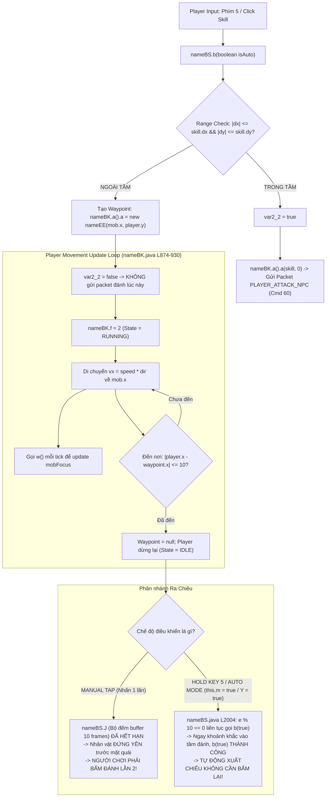

# BÁO CÁO NGHIÊN CỨU PASS 2: WORLD, MAP, FARM POCKETS & TARGETING IN NINJA SCHOOL ONLINE (NSO)
*Tài liệu đối chiếu kỹ thuật sâu dành cho kiến trúc sư và thiết kế game Huyền Lộ*

---

## 1. PHÂN TÍCH LẠI CALL-CHAIN: AUTO-APPROACH → ATTACK (ĐÍNH CHÍNH VÀ CHI TIẾT HÓA)

Trong nghiên cứu Pass 1, chúng ta quan sát thấy khi bấm đánh ngoài tầm, nhân vật tự chạy tới mục tiêu rồi ra chiêu. Tuy nhiên, khi đào sâu từng dòng mã nguồn decompile của Client ([`nameBS.java`](file:///home/nguyenvanrin/.gemini/antigravity-cli/brain/ebc98840-85c9-423b-a2f4-d7cc0190f869/scratch/client_decompiled/nameBS.java) và [`nameBK.java`](file:///home/nguyenvanrin/.gemini/antigravity-cli/brain/ebc98840-85c9-423b-a2f4-d7cc0190f869/scratch/client_decompiled/nameBK.java)), **bản chất thực tế có sự phân hóa cực kỳ tinh tế giữa Manual Mode (Bấm tay đơn lẻ) và Auto/Hold Mode (Giữ phím / Tự đánh)**.

### Sơ đồ Call-Chain thực tế trong Client NSO:



### Bằng chứng mã nguồn (Evidence)

1. **Khởi tạo Waypoint khi ngoài tầm**:
   - File: [`nameBS.java`](file:///home/nguyenvanrin/.gemini/antigravity-cli/brain/ebc98840-85c9-423b-a2f4-d7cc0190f869/scratch/client_decompiled/nameBS.java), dòng 2965–2977.
   ```java
   var4_3 = Math.abs(nameBK.a().a - nameBK.a().a.c); // |player.x - mob.x|
   var5_7 = Math.abs(nameBK.a().b - nameBK.a().a.d); // |player.y - mob.y|
   if (var4_3 > nameBK.a().a.a() || var5_7 > nameBK.a().a.b()) { // Ngoài dx hoặc dy
       nameBK.a().a = new nameEE(nameBK.a().a.c, nameBK.a().b); // Gán waypoint di chuyển
       nameCX.j(); nameCX.i();
       var2_2 = false; // Đánh dấu KHÔNG ra chiêu ngay
   }
   ```
2. **Khi di chuyển tới đích**:
   - File: [`nameBK.java`](file:///home/nguyenvanrin/.gemini/antigravity-cli/brain/ebc98840-85c9-423b-a2f4-d7cc0190f869/scratch/client_decompiled/nameBK.java), dòng 874–886 và 918–931.
   ```java
   if (this.a != null && (this.f == 1 || this.f == 2)) {
       this.f = 2; // f = 2: State RUNNING
       if (Math.abs(this.a - this.a.a) <= 10) {
           this.a = null; // Đến đích -> Xóa waypoint, f trở về IDLE
       }
   }
   ```
   *Lưu ý cốt tử*: **Client NSO không hề có biến `pendingSkill`, không có `actionAfterMove` callback**.

3. **Cơ chế gọi lại Attack (The Retrigger Mechanism)**:
   - File: [`nameBS.java`](file:///home/nguyenvanrin/.gemini/antigravity-cli/brain/ebc98840-85c9-423b-a2f4-d7cc0190f869/scratch/client_decompiled/nameBS.java), dòng 1978–2009.
   ```java
   // Khi nhấn phím 5:
   if (nameBS.J == 0) {
       nameBS.J = 10; // Cấp 10 frame buffer đệm đòn đánh
   }
   // Trong vòng lặp GameScr update:
   if (nameCX.e % 10 == 0 && nameBS.J > 0 && (nameBK.a().a != null)) {
       this.b(true); // Liên tục thử kích hoạt đòn đánh nếu bộ đệm J còn sống
   }
   if (nameBS.J > 1) {
       --nameBS.J; // Đếm lùi mỗi frame
   }
   ```
   - **Trường hợp bấm 1 lần (Manual Tap)**: Quái ở xa $> 60\text{px}$, người chơi chạy mất $\approx 15-20$ frames. Lúc này `nameBS.J` đã giảm về 0 từ lâu. Khi chạy tới nơi, nhân vật đứng im đối diện quái. Người chơi phải bấm đánh lần thứ 2 thì đòn đánh mới xuất ra!
   - **Trường hợp giữ phím hoặc Bật Auto (`nameBK.a().Y = true`)**: `nameBS.J` được duy trì liên tục, do đó khi nhân vật vừa bước vào ngưỡng `dx`, hàm `this.b(true)` lập tức khớp điều kiện trong tầm và gửi packet tấn công ngay frame đó.

### Trả lời cụ thể 7 trường hợp kiểm tra:

| STT | Tình huống | Hành vi chính xác của NSO | Bằng chứng code |
| :--- | :--- | :--- | :--- |
| **1** | **Normal Attack** | Dùng chung 100% logic với skill. Đòn đánh thường bản chất là Skill Template ID 0, có `dx, dy` riêng (thường là 45x30px). | [`nameBS.java`](file:///home/nguyenvanrin/.gemini/antigravity-cli/brain/ebc98840-85c9-423b-a2f4-d7cc0190f869/scratch/client_decompiled/nameBS.java#L2965) |
| **2** | **Active Skill** | Giống normal attack, nhưng kiểm tra thêm MP và Cooldown trước khi set waypoint. Nếu thiếu MP hoặc đang CD thì báo lỗi chữ đỏ trên màn hình và không tạo waypoint. | [`nameBS.java`](file:///home/nguyenvanrin/.gemini/antigravity-cli/brain/ebc98840-85c9-423b-a2f4-d7cc0190f869/scratch/client_decompiled/nameBS.java#L2955) |
| **3** | **Auto Mode (Tự đánh)** | Bật bằng cách nhấn đúp phím 5 (`this.m = true; nameBK.a().Y = true`). Khi bật, cứ mỗi 10 frame game tự gọi `b(true)`. Nhân vật tự chạy tiếp cận và tự tung chiêu liên tục mà không cần input. | [`nameBS.java`](file:///home/nguyenvanrin/.gemini/antigravity-cli/brain/ebc98840-85c9-423b-a2f4-d7cc0190f869/scratch/client_decompiled/nameBS.java#L1985-L2006) |
| **4** | **Click/Touch Target rồi bấm đánh** | Click chuột/chạm tay gán `nameBK.a().a = clickedMob` và đặt cờ `nameBK.ab = true` (khóa cứng con trỏ). Sau đó bấm đánh sẽ auto-approach thẳng tới mob này. | [`nameBK.java`](file:///home/nguyenvanrin/.gemini/antigravity-cli/brain/ebc98840-85c9-423b-a2f4-d7cc0190f869/scratch/client_decompiled/nameBK.java#L6500) |
| **5** | **Target chết trong lúc đang chạy** | Hàm `w()` chạy mỗi frame trong lúc di chuyển (`nameBK.java` L892). Khi quái chết (`mob.isDie == true`), `mobFocus` bị set thành `null`. Waypoint tĩnh `nameEE` vẫn đưa player chạy tới tọa độ cũ rồi dừng hẳn. | [`nameBK.java`](file:///home/nguyenvanrin/.gemini/antigravity-cli/brain/ebc98840-85c9-423b-a2f4-d7cc0190f869/scratch/client_decompiled/nameBK.java#L6465) |
| **6** | **Target chạy khỏi range lúc player approach** | Waypoint gán tọa độ tĩnh `(mob.x, player.y)` tại thời điểm bấm. Khi player chạy tới tọa độ đó thì mob đã đi chỗ khác -> Vẫn ngoài tầm -> Nhân vật dừng lại và không tự đánh (trừ phi đang bật Auto Mode). | [`nameBS.java`](file:///home/nguyenvanrin/.gemini/antigravity-cli/brain/ebc98840-85c9-423b-a2f4-d7cc0190f869/scratch/client_decompiled/nameBS.java#L2974) |
| **7** | **Player tự bấm phím di chuyển giữa chừng** | Vòng lặp input kiểm tra: Nếu bất kỳ phím điều hướng nào (Trái, Phải, Nhảy, Xuống) được nhấn, client lập tức gán `nameBK.a().a = null`. **Auto-approach bị hủy tức thì**, người chơi nắm trọn quyền điều khiển. | [`nameBS.java`](file:///home/nguyenvanrin/.gemini/antigravity-cli/brain/ebc98840-85c9-423b-a2f4-d7cc0190f869/scratch/client_decompiled/nameBS.java#L2590-L2596) |

- **ĐỘ TIN CẬY (CONFIDENCE)**: **HIGH**
- **BÀI HỌC CHO HUYỀN LỘ**:
  - Không nên làm cơ chế "bấm 1 lần chạy tới nơi tự đánh" nếu không có trạng thái rõ ràng, vì dễ gây cảm giác nhân vật bị "cướp quyền điều khiển" (loss of control).
  - Huyền Lộ nên phân tách minh bạch:
    - *Manual Combat*: Bấm skill ngoài tầm -> Tự chạy tới cự ly hợp lệ. Nếu người chơi tiếp tục giữ nút tấn công hoặc bấm nhịp tiếp theo -> Xuất chiêu. Nếu thả tay ra -> Dừng ở tư thế sẵn sàng chiến đấu (Ready/Combat Idle).
    - *Auto Combat*: Chỉ tự chạy và tự xuất chiêu liên tục khi người chơi chủ động kích hoạt chế độ Auto-battle.
    - Mọi input di chuyển của người chơi **bắt buộc phải ngắt ngay lập tức** tiến trình auto-approach.

---

## 2. MAP STRUCTURE TRONG NSO (PHÂN TÍCH TỪ DỮ LIỆU GỐC)

Qua việc giải mã trực tiếp dữ liệu nhị phân từ thư mục `SRC NSOACE FIX/Data/Map/` và đối chiếu bảng SQL `map` trong `nsoz.sql`, chúng tôi thu được thông số cấu trúc thế giới thực tế của NSO như sau:

### A. Thông số Kỹ thuật Chuẩn của Bản đồ NSO
- **Tile Size**: Cố định $24 \times 24$ pixels ([`TileMap.java`](file:///home/nguyenvanrin/PersonalProjects/rpg-online/research/SRC%20NSOACE%20FIX/src/com/nsoz/map/TileMap.java#L80) `private final int size = 24;`).
- **Kích thước Map phổ biến**:
  - *Bản đồ chuẩn (Standard Map)*: $80 \times 14$ đến $80 \times 20$ tiles ($1920\text{px} \times 336\text{px}$ đến $1920\text{px} \times 480\text{px}$). Chiều ngang tương đương đúng 1–2 màn hình cuộn ngang.
  - *Bản đồ Làng / Hub chính*: $120 \times 14$ đến $120 \times 20$ tiles ($2880\text{px} \times 336-480\text{px}$). Dài hơn để chứa các NPC chức năng, chợ và cổng chuyển map.
  - *Bản đồ Vực sâu / Hang động (Vertical / Multi-floor)*: Chiều cao lên tới 26–30 tiles ($624\text{px} - 720\text{px}$).
- **Khoảng cách trục Y giữa các Platform ($\Delta Y$)**:
  - Khoảng cách cực kỳ chuẩn mực: **$\Delta Y = 48\text{px}$ (đúng bằng 2 tiles)** hoặc **$72\text{px}$ (3 tiles)**.
  - Chiều cao nhảy cơ bản của Ninja trong NSO đạt khoảng $60-80\text{px}$, cho phép người chơi nhảy 1 nhịp nhẹ là chạm tới tầng trên ngay lập tức.
- **Cấu trúc Vực & Mép sàn**:
  - Hầu hết các map farm dã ngoại là **sàn đất kín** chạy dài.
  - Vực chết (`T_DIE = 16384`) chỉ xuất hiện ở các map đặc thù (Vực Kyogetsu, Thác Kitajima, Thất Thú Ải). Khi rớt xuống vực, người chơi mất 50% HP và bị dịch chuyển về waypoint an toàn gần nhất.

---

### B. Khảo sát 6 Bản đồ Tiêu biểu (Kèm ASCII Diagram)

#### 1. Map Hub / Khởi đầu: Map 22 - Làng Tone (120x14 tiles = 2880x336 px)
- **Đặc điểm**: Map phẳng 1 tầng chính chạy dài, không có quái vật. Toàn bộ NPC chức năng (Kenshiko, Umaru, Tabemono, Trưởng làng) dàn trải đều từ $X = 300$ đến $X = 2600$.
- **Bố cục Platform**: 1 sàn đất chính ở đáy ($Y = 288\text{px}$), phía trên có vài mái nhà trang trí ($Y = 192\text{px}$) có thể nhảy lên đứng nhưng không có gameplay.

```
Y(px)
 0   |---------------------------------------------------------------------------------------------------|
 96  |       [Mái Nhà]                                      [Cột Cờ]                           [Cổng Map]|
192  |       ========                                       ========                           ========= |
288  |===[Portal Sang Đồi Fuki]=====[NPC Quán Ăn]=====[NPC Rương]=====[NPC Nâng Cấp]=====[Portal Rừng Gozu]===|
     +---------------------------------------------------------------------------------------------------+
     0px                                             1440px                                            2880px
```

#### 2. Map Farm Đầu Game: Map 1 - Đồi Fuki (80x20 tiles = 1920x480 px)
- **Đặc điểm**: 3 tầng platform thoải dần từ trái qua phải.
- **Mob Spawn**: 24 quái (Ốc sên, Nhím gai) rải đều trên 3 tầng ($Y = 240, 312, 384\text{px}$).
- **Khoảng cách tầng**: $\Delta Y = 72\text{px}$.

```
Y(px)
 0   |--------------------------------------------------------------------------------|
120  |                                                                                |
240  | [Portal Làng] ====== (Ốc Sên x3) ======                                        |
312  |                          ============== (Nhím Gai x4) =============            |
384  |                                                       =========== (Ốc Sên x4)==|
480  |--------------------------------------------------------------------------------|
     0px                                           960px                            1920px
```

#### 3. Map Farm Đa Tầng (Multi-Floor): Map 50 - Rừng Kanashii (94x26 tiles = 2256x624 px)
- **Đặc điểm**: Bản đồ rừng rậm cao vút, có tới **9 tầng platform chồng lớp**.
- **Mob Spawn**: 46 quái (Khỉ, Châu chấu, Bí ngô).
- **Khoảng cách tầng $\Delta Y$**: Đúng $48\text{px}$ (2 tiles)! Tầng $Y = 96, 144, 192, 240, 312, 360, 432, 504, 552\text{px}$.
- **Ý nghĩa Combat**: Do khoảng cách $48\text{px} < 50\text{px}$ (ngưỡng splash dọc), các chiêu quét lan của người chơi khi chém ở tầng dưới ăn trọn quái ở tầng trên!

```
Y(px)
 96  |          ====[Khỉ x3]====                                                      |
144  |   ===[Châu chấu x5]===                  ====[Khỉ x4]====                       |
192  |                               ====[Châu chấu x6]====                           |
240  |          ====[Khỉ x4]====                                   ====[Khỉ x4]====   |
312  |   ==============================[Châu chấu x4]==============================   |
360  |                  ====[Khỉ x6]====                  ====[Châu chấu x6]====      |
432  |   ====[Khỉ x5]====                      ====[Bí Ngô Boss]====                  |
504  |                          ====[Khỉ x2]====                                      |
552  |========================[Sàn Đáy Rừng: 11 Quái Tụ Đám]===========================|
     +--------------------------------------------------------------------------------+
     0px                                           1128px                           2256px
```

#### 4. Map Dọc / Thác Nước: Map 6 - Thác Kitajima (20x84 tiles = 480x2016 px)
- **Đặc điểm**: Map siêu hẹp ngang (chỉ 480px = đúng 1 bề rộng màn hình), nhưng cực cao (2016px).
- **Cấu trúc**: Thang leo, dây leo và các mỏm đá nhỏ gián đoạn nhô ra hai bên vách đá. Người chơi phải nhảy ziczac từ dưới đáy leo lên đỉnh thác.

---

## 3. CÁCH XẾP QUÁI & PHÂN BỐ CỤM FARM (FARM POCKETS)

### A. Bản chất Thiết kế: Spawn Cố định tạo Pocket
- **Bằng chứng Server**: Trong file [`MapManager.java`](file:///home/nguyenvanrin/PersonalProjects/rpg-online/research/SRC%20NSOACE%20FIX/src/com/nsoz/map/MapManager.java#L116) và dữ liệu `nsoz.sql`, toàn bộ quái vật được định nghĩa tọa độ spawn $(x, y)$ **hoàn toàn cố định**.
- Không có hệ thống "random spawn trong polygon".
- Quái chết đi sẽ respawn lại đúng tại tọa độ $(xFirst, yFirst)$ sau đúng **12 giây** (xem mục 4).

### B. Khoảng cách giữa các Quái (Mob Spacing) & AoE Threshold
Dữ liệu phân tích thực tế từ 13 maps mẫu cho thấy các con số ấn tượng:
1. **Trong một Pocket (Cụm quái)**:
   - Các quái được đặt cách nhau: **$24\text{px}, 48\text{px}$ hoặc tối đa $72\text{px}$** (đúng 1 đến 3 tiles).
   - Một cụm thường có từ **3 đến 5 con**.
2. **Khoảng cách giữa các Pockets**:
   - Khoảng trống giữa cụm này sang cụm kia trên cùng platform là **$200\text{px} - 350\text{px}$**.
3. **Mối liên hệ tương hỗ với Chỉ số Combat**:
   - Bán kính quét lan Multi-target của Client là: $X \pm 100\text{px}, Y \pm 50\text{px}$ ([`nameBK.java`](file:///home/nguyenvanrin/.gemini/antigravity-cli/brain/ebc98840-85c9-423b-a2f4-d7cc0190f869/scratch/client_decompiled/nameBK.java#L1910)).
   - Chỉ số `maxFight` của kỹ năng thường là **3 đến 4 mục tiêu**.
   - **KẾT LUẬN THIẾT KẾ CỐ Ý**: NSO cố tình sắp xếp các cụm quái gồm 3–4 con nằm gọn trong dải bề ngang $70-100\text{px}$ để khi người chơi tung 1 chiêu thức lan, toàn bộ số mục tiêu cho phép (`maxFight`) đều được kích nổ sát thương cùng lúc!

### C. Quái có dồn lại thành đám không?
- Biên độ tuần tra của quái (`rangeMove`) thường là $100\text{px} - 150\text{px}$.
- Vì khoảng cách giữa các con trong cụm chỉ là 24–48px, các vùng tuần tra của chúng **chồng lấn lên nhau hoàn toàn (heavily overlapping)**.
- Khi quái di chuyển ngẫu nhiên trái/phải quanh spawn, chúng thường xuyên đi lướt qua nhau hoặc tụ lại sát rạt thành một bó quái, tạo cảm giác mục tiêu gom lại tự nhiên mà không cần AI phức tạp.

---

## 4. VÒNG LẶP FARM THỰC TẾ CỦA NGƯỜI CHƠI (PLAYER FARM FLOW)

Từ các thông số mã nguồn, chúng tôi dựng lại trọn vẹn chu kỳ cày cuốc (Farm Loop) kinh điển của người chơi NSO:

### A. Chu kỳ Thời gian & Di chuyển (The 12-Second Loop)
- **Thời gian hồi sinh**: Quái thường mất đúng **12 giây** để hồi sinh ([`Mob.java`](file:///home/nguyenvanrin/PersonalProjects/rpg-online/research/SRC%20NSOACE%20FIX/src/com/nsoz/mob/Mob.java#L279) `this.recoveryTimeCount = 12;`).
- Một người chơi có trang bị trung bình dọn sạch 1 Pocket (3–4 quái) mất khoảng **2 đến 3 giây**.
- **Hệ quả**: Nếu người chơi đứng yên tại chỗ, họ sẽ phải chờ không làm gì trong 9–10 giây.
- **Hành vi tối ưu thực tế**: Người chơi thiết lập một **"Vòng tuần hoàn 3 bãi" (3-Pocket Rotation)** trên cùng một platform:
  1. *Giây 0–3*: Tiêu diệt Pocket A (3 quái).
  2. *Giây 3–5*: Chạy bộ 200px sang Pocket B.
  3. *Giây 5–8*: Tiêu diệt Pocket B (4 quái).
  4. *Giây 8–10*: Chạy bộ 200px sang Pocket C (hoặc quay lại Pocket A).
  5. *Giây 10–12*: Vừa bước chân trở lại Pocket A thì quái vừa vặn hồi sinh (đủ 12s)!
  $\rightarrow$ Tạo ra nhịp farm liên tục không có thời gian chết (zero downtime farm rhythm).

### B. Cơ chế Chuyển Target khi Quái Chết
- Trong [`nameBK.java`](file:///home/nguyenvanrin/.gemini/antigravity-cli/brain/ebc98840-85c9-423b-a2f4-d7cc0190f869/scratch/client_decompiled/nameBK.java) dòng 6465: Khi quái mục tiêu chết (`isDie == true`), `mobFocus` bị hủy.
- Ở frame tiếp theo, hàm `w()` tự động quét và bám ngay vào con quái sống gần nhất trong bán kính màn hình.
- Trong chế độ Auto-train (`Y = true`), việc chọn quái mới lập tức kích hoạt auto-approach đưa nhân vật tự động sải bước sang Pocket kế tiếp.

### C. Cơ chế Nhặt Đồ (Loot Pickup)
- Vật phẩm rơi ra đất (`ItemMap`) tồn tại độc lập trên server.
- Khi có vật phẩm dưới chân, nút đánh/hành động ưu tiên hiển thị lệnh nhặt đồ hoặc nhân vật nhặt theo luồng riêng.
- Trong Auto-train mode, client kiểm tra danh sách `ItemMap` trong tầm; nếu có item, nó gán waypoint tới nhặt trước khi tiếp tục auto-approach sang bãi quái mới.

---

## 5. COMBAT & MULTI-TARGET TRONG KHÔNG GIAN ĐA TẦNG

Đối chiếu 6 trường hợp hình học phức tạp giữa Người chơi, Quái vật và Địa hình:

| STT | Trường hợp Không gian | Cơ chế Target | Hành vi Di chuyển | Tính Hợp lệ của Skill Lan (AoE) | Thể hiện Hình ảnh (Visual) |
| :--- | :--- | :--- | :--- | :--- | :--- |
| **1** | **Player tầng dưới, Quái tầng trên** | Target được nếu chênh lệch $Y \le 50\text{px}$ + tầm chiêu. | Chỉ chạy ngang dưới sàn tầng mình tới cùng tọa độ X rồi dừng. **Không nhảy lên**. | **TRÚNG** nếu khoảng cách đứng $Y \le 50\text{px}$. | Caster vung kiếm ở dưới, hiệu ứng nổ sinh ra trên đầu quái ở tầng trên. |
| **2** | **Player tầng trên, Quái tầng dưới** | Target được nếu chênh lệch $Y \le 50\text{px}$. | Chỉ chạy ngang trên tầng mình. **Không rơi/thả xuống**. | **TRÚNG** nếu khoảng cách đứng $Y \le 50\text{px}$. | Tia đạn/chưởng bay chúc thẳng xuống sàn dưới nổ tung quái. |
| **3** | **Quái chính cùng tầng, Quái phụ tầng trên** | Quái chính được chọn bình thường. | Tiếp cận quái chính trên cùng sàn. | **TRÚNG CẢ HAI**! Bán kính splash tính từ quái chính ($\Delta X \le 100, \Delta Y \le 50$). | Hiệu ứng lan tỏa từ quái chính bốc lên nổ vào quái tầng trên. |
| **4** | **Hai platform sát nhau ($\Delta Y \le 48\text{px}$)** | Target và đánh bình thường như đứng cạnh nhau. | Chạy ngang trên sàn hiện tại. | **Đánh quét lan ăn trọn quái cả 2 tầng**. Đây là vị trí cày cấp ưa thích nhất của game thủ NSO. | Các tia đạn tỏa ra cả trên lẫn dưới. |
| **5** | **Platform che chắn bằng Solid Tile** | Target xuyên qua tường/sàn đá solid. | Chạy tới mép tường đá thì bị kẹt lại bởi `T_LEFT / T_RIGHT`. | **VẪN GÂY SÁT THƯƠNG XUYÊN ĐÁ**! Game không kiểm tra raycast cản địa hình cho đòn đánh. | Đạn/VFX bay xuyên qua khối đá đen trúng mục tiêu. |
| **6** | **Quái bay lơ lửng giữa 2 tầng** | Target được từ cả tầng trên lẫn tầng dưới. | Người chơi chạy tới ngay dưới chân quái bay. | Sát thương nhận đủ từ cả 2 tầng. | Quái bay chúc đầu xuống sàn để cận chiến. |

---

## 6. AI QUÁI VẬT, DI CHUYỂN & HÀNH VI MÉP VỰC (EDGE BEHAVIOR)

### A. Khám phá Kiến trúc Đột phá: Server không chạy Physics cho Quái!
Một phát hiện mang tính then chốt khi đọc [`Mob.java`](file:///home/nguyenvanrin/PersonalProjects/rpg-online/research/SRC%20NSOACE%20FIX/src/com/nsoz/mob/Mob.java#L1010):
- **Server NSO hoàn toàn KHÔNG cập nhật tọa độ $(x, y)$ của quái vật theo thời gian thực!**
- Tọa độ `this.x` và `this.y` trên server được **ghim cứng vĩnh viễn tại vị trí spawn**!
- Toàn bộ chuyển động đi tuần qua lại, chuyển động chúc đầu của quái bay, và va chạm mép sàn là **mô phỏng hình ảnh tự hành thuần túy trên Client (`nameDK.java`)**.
- Trên server: Mỗi chu kỳ logic, server chỉ tính khoảng cách giữa người chơi và tọa độ *spawn gốc* của quái. Nếu người chơi đi vào bán kính `rangeMove` của điểm spawn, server kích hoạt đồng hồ đếm lùi để gọi `attack()`.

### B. Hành vi Tuần tra và Xử lý Mép sàn (Client Edge Check)
- File [`nameDK.java`](file:///home/nguyenvanrin/.gemini/antigravity-cli/brain/ebc98840-85c9-423b-a2f4-d7cc0190f869/scratch/client_decompiled/nameDK.java), dòng 1084:
  ```java
  if (this.s == 0 && (nameDQ.a(this.c, this.d) & 2) == 2) {
      this.q = this.q > 4 ? -4 : -this.q; // Đảo ngược vector vận tốc di chuyển
      this.s = 16; // Khóa quay đầu trong 16 frames
  }
  ```
- **Hành vi**:
  1. Khi đi đến gần mép platform, quái kiểm tra tile phía trước. Nếu phía trước không còn cờ `T_TOP` (mặt đất), quái lập tức đảo ngược hướng di chuyển ($dir = -dir$).
  2. **Quái đất không bao giờ tự rơi xuống platform dưới**.
  3. Quái không bao giờ có thể bị kéo (pull/kite) đi xa khỏi spawn quá `rangeMove` (thường là 100–180px), vì khi $|x - xFirst| > rangeMove$, code ép nó quay đầu về tâm spawn.

---

## 7. HỆ THỐNG QUÁI BẮN XA (RANGED MOB SYSTEM)

### A. Phân loại Quái Melee vs Ranged
- Trong NSO, quái vật được phân định rõ ràng ngay từ dữ liệu mẫu:
  - **Quái Melee thuần**: Không có tham số đạn (mặc định gán effect cận chiến ID 59). Chỉ ra đòn khi người chơi đứng sát sạt.
  - **Quái Ranged thuần** (Ốc sên, Dơi, Cóc tía, Ma trơi): Được cấp một template đạn (`dartType`). Tầm tấn công xa $200\text{px} - 300\text{px}$.
  - **Không có cơ chế Hybrid đổi vũ khí**: Quái melee không hề có chiêu bắn xa dự phòng khi người chơi đứng trên cao tỉa xuống. Chúng sẽ hoàn toàn chịu trận đứng yên nếu người chơi đứng khác tầng tỉa xuống!

### B. Hệ thống Đạn Generic Projectile dùng chung
- **Bằng chứng Server**: Khi quái tấn công, server gửi gói `NPC_ATTACK_ME` (Cmd -3) chỉ gồm `mobId`, `damageHp`, `damageMp` ([`Service.java`](file:///home/nguyenvanrin/PersonalProjects/rpg-online/research/SRC%20NSOACE%20FIX/src/com/nsoz/network/Service.java#L811)).
- Server **hoàn toàn không sinh thực thể đạn**.
- **Bằng chứng Client**: Trong [`nameDK.java`](file:///home/nguyenvanrin/.gemini/antigravity-cli/brain/ebc98840-85c9-423b-a2f4-d7cc0190f869/scratch/client_decompiled/nameDK.java) dòng 907, client tự tạo một hiệu ứng visual dùng chung:
  `nameBX.a(this.d == -1 ? 59 : (int)this.d, x, y, 1, dir);`
  - Các loại đạn như cầu lửa, gai ốc sên, tia độc... chỉ là các ID animation chạy thẳng hoặc homing từ quái tới người chơi.
  - Khi hiệu ứng chạm tọa độ người chơi, số damage nhận từ packet server lập tức bay lên.

---

## 8. HỆ THỐNG QUÁI BAY & BỐ TRÍ MAP (FLYING MOBS)

### A. Định nghĩa Quái bay trong Mã nguồn
- Trong [`MobTemplate.java`](file:///home/nguyenvanrin/PersonalProjects/rpg-online/research/SRC%20NSOACE%20FIX/src/com/nsoz/mob/MobTemplate.java#L33): biến `public byte typeFly;`.
- Trong client [`nameDK.java`](file:///home/nguyenvanrin/.gemini/antigravity-cli/brain/ebc98840-85c9-423b-a2f4-d7cc0190f869/scratch/client_decompiled/nameDK.java#L1098): `typeFly` mang giá trị 4 hoặc 5.

### B. Vị trí Spawn & Giới hạn Không gian
- Quái bay luôn được đặt spawn tại các vùng không gian mở (**Open Sky**), thường cao hơn mặt sàn platform bên dưới khoảng **$60\text{px} - 100\text{px}$**.
- Chúng không bị giới hạn bởi mép sàn đất (vì không chạm tile `T_TOP`), nhưng bị giới hạn bởi hộp chữ nhật tuần tra:
  $$x \in [xFirst - rangeMove, xFirst + rangeMove]$$
  $$y \in [yFirst - 30, yFirst + 30]$$

### C. Cơ chế Hạ độ cao (Swoop Down) để Melee chém trúng
- File [`nameDK.java`](file:///home/nguyenvanrin/.gemini/antigravity-cli/brain/ebc98840-85c9-423b-a2f4-d7cc0190f869/scratch/client_decompiled/nameDK.java#L1236):
  ```java
  if (nameDK.a[this.k].c == 4 || nameDK.a[this.k].c == 5) {
      this.d += (target.y - this.d) / 20; // Nội suy kéo tọa độ Y của mob hạ thấp dần về phía player
  }
  ```
- **Ý nghĩa Thiết kế**:
  - Khi ở trạng thái tuần tra, quái bay cao hơn đầu người chơi, class cận chiến chém bình thường sẽ hụt.
  - Khi quái bay vào trạng thái tấn công người chơi, nó tự hạ độ cao chúc xuống ngang tầm ngực ($target.y - 20\text{px}$). Lúc này, người chơi cận chiến đứng dưới đất có thể vung kiếm chém trúng 100%.
  - Ngoài ra, người chơi có thể bấm Nhảy (Jump) lên không trung để chém quái khi nó đang lơ lửng trên cao.

---

## 9. QUAN HỆ GIỮA VFX & BỐ CỤC MAP

Qua kiểm tra thứ tự vẽ trong [`nameBS.java`](file:///home/nguyenvanrin/.gemini/antigravity-cli/brain/ebc98840-85c9-423b-a2f4-d7cc0190f869/scratch/client_decompiled/nameBS.java) và lớp [`nameBX.java`](file:///home/nguyenvanrin/.gemini/antigravity-cli/brain/ebc98840-85c9-423b-a2f4-d7cc0190f869/scratch/client_decompiled/nameBX.java):
1. **Hoàn toàn không có Raycast/Occlusion Terrain**:
   VFX đòn đánh, tia đạn và hiệu ứng nổ không hề thực hiện kiểm tra va chạm với các tile đất đá. Chúng được vẽ đè lên lớp tilemap.
2. **Xuyên thấu Geometry**:
   Nếu giữa Caster và Target có một bức tường đá hoặc một tầng sàn solid, mũi tên của phái Cung hoặc chưởng của phái Tiêu vẫn bay xuyên thẳng qua khối đá để cắm vào người quái.
3. **Target-Centric Impact**:
   Target Impact VFX luôn luôn bám chặt vào tâm tọa độ sprite của Entity nhận đòn (`target.x, target.y`), đảm bảo dù quái có đang ở mỏm đá nào thì hiệu ứng nổ và số sát thương vẫn hiển thị chuẩn xác trên đầu nó.

---

## 10. PHÂN LOẠI DI SẢN CŨ (LEGACY CONSTRAINTS EVALUATION)

Để tránh việc sao chép một cách thiếu chọn lọc những cơ chế thô sơ vốn chỉ tồn tại do giới hạn phần cứng điện thoại bàn phím thời 2010–2012, chúng tôi phân loại toàn bộ các pattern đã nghiên cứu thành 4 nhóm rõ rệt:

### Nhóm A: TIMELESS GOOD DESIGN (Thiết kế Tuyệt vời, Cần học tập cho Huyền Lộ)
1. **Target-based Stat Roll trên Server (Acc vs Eva)**:
   Không dùng vật lý đạn bay thời gian thực trên server. Tính toán hit/miss và trừ máu tức thì, chống hoàn toàn hiện tượng desync và lag mạng trên kết nối di động.
2. **Sticky Nearest Combat Focus**:
   Khóa chặt mục tiêu đã chọn, không bị đổi target lộn xộn mỗi frame khi có quái khác đi ngang qua.
3. **Phân tầng VFX 4 lớp độc lập**:
   Tách biệt Caster Animation $\rightarrow$ Caster Aura $\rightarrow$ Travel Projectile (Visual only) $\rightarrow$ Target Impact. Cực kỳ linh hoạt khi dựng tài nguyên đồ họa.
4. **Target HUD riêng biệt + Không vẽ thanh máu tràn lan**:
   Giữ màn hình chiến đấu sạch sẽ, chỉ vẽ marker và mini HP bar trên đầu đúng 1 con quái đang nhận Focus.

### Nhóm B: GOOD FOR THIS GENRE (Rất tốt cho ARPG Màn hình ngang)
1. **Bố trí quái theo Farm Pockets (Cụm 3–4 con)**:
   Khoảng cách 24–48px khớp chính xác với bán kính Multi-target Splash $X \pm 100\text{px}$.
2. **Chu kỳ hồi sinh 12 giây tạo Farm Rotation Loop**:
   Thúc đẩy người chơi liên tục luân chuyển giữa 2–3 bãi quái trên một sàn thay vì đứng yên một chỗ.
3. **Cho phép Kỹ năng Lan xuyên tầng ($\Delta Y \le 48-60\text{px}$)**:
   Giúp nhịp độ combat mượt mà, người chơi đứng dưới sàn thấp vẫn quét được quái trên gờ đá sát bên cạnh.
4. **Quái bay tự hạ độ cao khi tấn công**:
   Tạo ra "cửa sổ phản công" (Counter-attack window) tự nhiên cho các lớp nhân vật cận chiến.

### Nhóm C: LEGACY CONSTRAINTS (Hạn chế do Công nghệ Cũ J2ME / Mobile 2012)
1. **Quái đất hoàn toàn làm ngơ người chơi khác tầng**:
   Do CPU máy chủ và điện thoại Java thời đó quá yếu để chạy pathfinding nhảy tầng cho hàng vạn con quái.
2. **Server không cập nhật tọa độ di chuyển của quái**:
   Toàn bộ movement là client visual giả lập quanh điểm spawn gốc để tiết kiệm tối đa băng thông GPRS 2G.
3. **Phạm vi tính toán bằng hard-coded pixel ($X \le 45, Y \le 30$)**:
   NSO thiết kế cố định cho độ phân giải màn hình $240 \times 320$ hoặc $320 \times 480$. Khi đưa lên màn hình Full HD / 2K, các khoảng cách pixel này bị lỗi thời.
4. **Không có phím Cycle Target (Tab target)**:
   Do điện thoại phổ thông (Nokia S40/S60) chỉ có bàn phím số T9 (phím 1–9, *, #), không đủ nút để bố trí phím đổi mục tiêu chuyên dụng.

### Nhóm D: SHOULD MODERNIZE (Ý tưởng Tốt nhưng Cần Hiện đại hóa trên Huyền Lộ)
1. **Hành vi Quái khi bị tấn công từ xa / khác tầng**:
   Huyền Lộ không nên để quái đứng im "làm bia tập bắn". Cần bổ sung AI: Khi bị bắn tỉa từ sàn khác mà không tiếp cận được, quái đất phải bật khiên phòng thủ, kích hoạt đòn ném đá tầm xa, hoặc chủ động lùi lại tìm góc khuất.
2. **Auto-Approach UX**:
   Cần hiển thị rõ ràng đường dẫn hoặc hiệu ứng lướt (Dash approach) thay vì chỉ đi bộ ngang thô cứng; đồng thời hỗ trợ phím chuyển mục tiêu thông minh (Tab / R-stick trên Gamepad).
3. **Terrain Collision trong Combat**:
   Đạn bắn tầm xa không nên bay xuyên qua các bức tường đá dày hay sàn đá solid dày. Nên có raycast terrain đơn giản để đạn chạm tường thì phát nổ hụt, khuyến khích người chơi chọn vị trí đứng thông minh hơn.
